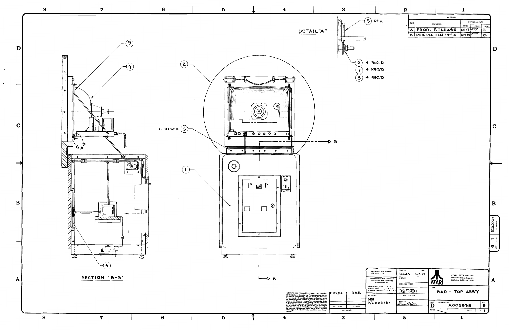

# GOAL IV | Wold Cup | Coupe Du Monde: Atari TM-035: Operation, Maintenance, and Service Manual

ATARI Innovative leisure  
14600 Winchester Blvd.  
Los Gatos, CA 95030  
Telephone (408) 374-2440  
Telex 357-488

## Table of Contents
- [A. Introduction and Warranty](#a-introduction-and-warranty)
- [B. New Machine Setup Procedure](#b-new-machine-setup-procedure)
- [C. Service Access](#c-service-access)
- [D. New Machine Checkout](#d-new-machine-checkout)
- [E. Game Sequence](#e-game-sequence)
- [F. Circuit Board Adjustments](#f-circuit-board-adjustments)
- [G. Static Modification](#g-static-modification)
- [H. T.V. Monitor Adjustment](#h-tv-monitor-adjustment)
- [I. Coin Acceptor: Operation, Adjustment & Maintenance](#i-coin-acceptor-operation-adjustment--maintenance)
- [J. General Maintenance](#j-general-maintenance)
- [K. Troubleshooting](#k-troubleshooting)
- [L. Detailed Circuit Description](#l-detailed-circuit-description)
  - [Introduction](#introduction)
  - [Test Equipment](#test-equipment)
  - [Adjustments](#adjustments)
  - [General Troubleshooting Approach](#general-troubleshooting-approach)
  - [Block Diagram Description](#block-diagram-description)
  - [Power Supply](#power-supply)
  - [Computer Clock](#computer-clock)
  - [Horizontal Sync Circuitry](#horizontal-sync-circuitry)
  - [Vertical Sync Circuitry](#vertical-sync-circuitry)
  - [Sync Summing](#sync-summing)
  - [Windows](#windows)
  - [Electronic Latch Circuit](#electronic-latch-circuit)
  - [Credit Circuit](#credit-circuit)
  - [Start Circuit](#start-circuit)
  - [Time Line Circuit](#time-line-circuit)
  - [Playfield Circuit](#playfield-circuit)
  - [Game Select Circuit](#game-select-circuit)
  - [Players Circuit](#players-circuit)
  - [Serve Timing Circuit](#serve-timing-circuit)
  - [Catch/Kick/Horizontal Direction Circuit](#catchkickhorizontal-direction-circuit)
  - [Ball Motion](#ball-motion)
  - [Vertical Direction and Speed Circuit](#vertical-direction-and-speed-circuit)
  - [Horizontal Direction and Speed Circuit](#horizontal-direction-and-speed-circuit)
  - [Ball Motion Circuit](#ball-motion-circuit)
  - [Hit Circuit](#hit-circuit)
  - [Moving Hole Circuit](#moving-hole-circuit)
  - [Window/Miss/Bounce Circuit](#windowmissbounce-circuit)
  - [Sound Circuit](#sound-circuit)
  - [Score Circuit](#score-circuit)
  - [Video Summing Circuit](#video-summing-circuit)

---

## A. Introduction and Warranty

Goal IV is a video amusement device which simulates a soccer game. It may be used by one, two, three, or even four players.

This game has been designed with solid state circuitry to be as maintenance-free as possible. However, as with all devices, mechanical or electrical, there may be minor problems.

If the printed circuit board (PCB) fails within the one-year* warranty period, contact the distributor from whom the game was originally purchased for replacement or repair instructions. All such warranty returns must be accompanied by completed warranty return forms. Any PCB repairs attempted by anyone other than authorized Atari Service Center personnel will void the warranty.

If the PCB fails after the warranty period has expired, it will be repaired for a nominal parts and labor charge.

Atari, Inc. warrants the T.V. monitor for a period of thirty days commencing the day of shipment from the Atari factory. If the monitor fails within that period, immediately contact the distributor from whom the game was originally purchased for repair or replacement instructions. Any T.V. repairs (other than replacement of fuses or adjustments) attempted during the warranty period by anyone other than authorized Atari Service Center personnel will void the warranty.

If the T.V. monitor fails after the warranty period has expired, it may be returned to the distributor where it will be repaired for a nominal parts and labor charge, or it may be taken to any competent T.V. repair shop.

*From date of shipment from the factory.

## B. New Machine Setup Procedure

Before turning this machine on, inspect it carefully for any damage which may have occurred during shipment.

Inspect both the interior and exterior of the machine for any obvious damage to the cabinet or internal components. Check for cracked or broken cabinet parts, assemblies pulling loose, broken or disconnected wires, or foreign objects shorting electrical connections. 

After the machine has been plugged in and turned on, perform the checkout procedure.

## C. Service Access

All servicing is performed inside the machine through the hinged top that provides access to all components, sub-assemblies, and adjustments with the exception of the coin box. 

The coin door is located on the front of the machine underneath the control panel. To remove the coins, unlock the metal coin door, grasp the door lip, and pull out the coin box.

To reach the interior of the machine, unlock the coin door and reach upwards just inside the door opening. Near the top of the interior compartment is a chain. Pull down on this chain and, with the other hand, lift up the hinged top. To hold the top open, lift up the metal support rod on the right side of the base's top edge and insert the end of the rod into the oval slot at the right front side of the TV chassis.

Please note that two interlock switches are provided for the game, so that the machine is completely turned off whenever either the top or coin door is opened. These switches protect the operator from accidental shock and so they must always be kept in perfect working order. If the machine is adjusted or tested with the rear door open, the interlock switches must be placed in the closed (or "on" position) by pulling out the white actuator shafts.

WARNING: The covered black terminal block carries full line voltage whenever the line plug is connected to a power outlet. This cover should be removed only with the line plug disconnected. Do not leave off the cover once it has been removed.

## D. New Machine Checkout

As each new machine leaves the factory, every component and sub-assembly is carefully checked for proper operation. However, since parts may have been damaged or adjustments changed during shipping, the following checkout procedure must be repeated prior to placing the machine on location:

1. Inspect both the exterior and interior of the machine for obvious shipping damage such as cracked or broken cabinet parts, sub-assemblies broken loose, etc.
2. Carefully inspect the interior of the machine to see that all solder joints, slip-on connectors, and plug-in type connectors are firmly seated. Pay particular attention to the PCB edge connector, the fuses, and the slip-on connectors to the potentiometers, the kick switches, the start switch, and the mode selector switch. Also check the connections to the coin switch, the T.V. monitor, the interlock switches, and all the other Molex-type connectors.
3. Plug the machine in, and pull out the white actuator shafts of the interlock switches if the rear door is open. Inspect the CRT (cathode ray tube) image for a steady and sharp picture which exhibits the proper levels of brightness and contrast.
4. Insert several old and new coins into the coin acceptor. No genuine coin should be rejected and each coin insertion should step the coin counter one digit. Depress the coin rejector button to make sure that the linkage is operating smoothly.
5. Coin insertion should produce game credit which is indicated by a small red light (LED) in the start switch button mounted on the control panel.
6. Depress the start switch button and check for proper game sequence, making sure that all aspects of the game (i.e. paddle display and control, score count and display, ball motion, etc.) are functioning correctly. If you are not familiar with the game sequence for Goal IV, read the game sequence description.
7. Operate all the players' paddle controls to make sure the potentiometers exhibit no evidence of "noise" (erratic jumping of the paddle image) as the paddles traverse the screen, and that all the kick switches operate when firmly pressed. The machine will automatically kick if the kick switch is not pressed within three seconds.
8. The door locks should turn to the "locked" and "unlocked" positions smoothly and the doors should open and close without binding.
9. The interlock switches must turn off the entire machine when the rear door is opened. (SEE THE "WARNING" UNDER SECTION "C".)
10. Check the carriage bolts which connect the metal legs to the cabinet to make sure that the stress and lock washers are in place, and the nuts are tightly screwed down.

## E. Game Sequence

Before the coin is inserted and the start switch pressed, the CRT will display the "ATTRACT MODE" - a ball rebounding from the playfield walls and the players' paddles.

Coin insertion lights the red credit lamp in the start switch button, indicating there is game credit and pressing this button begins the new game.

At this point, the goals and the time line appear. The goals are two open areas in the playfield perimeter; the object of the game is to shoot the ball into the opposing players' goal. The time line is an ever-shortening line located on the CRT outside the left edge of the playfield perimeter. This line indicates the amount of time left to play the game. When the time line completely disappears, the game is over.

The game can be played in either of two modes by changing the position of the mode selector switch located below the start switch on the front panel. If this switch is set to position "1", the game will be conditioned to "one player vs. the machine." If the mode selector switch is set to position "2", the machine will be conditioned for "solid players vs. checked players."

**MODE #1:** If the mode selector switch is set to position '1' (one player vs. the machine), the game sequence is as follows: Coin insertion lights the credit lamp and the game commences when the lighted start button is pressed, producing this CRT configuration:

The player has three paddles (or 'men') and the machine has none. The player has a large goal through which the ball can easily pass if the player is not alert. The "machine" has a small, moving goal and a carefully aimed shot is required to place the ball in this moving goal.

The machine serves automatically from the middle of the CRT. The object of the game is to bounce or kick the ball into the machine's goal. One of the player's potentiometers controls the player's forward men (the "forwards") and the other is used to maneuver the player's goalie.

The ball is stopped when it contacts one of the men. Depressing the potentiometer knob kicks the ball from that man. The direction of the kick is manipulated by moving the paddle image before pressing for the kick. If the knob is not pressed within three seconds, the machine automatically kicks the ball. If the man is moved off the ball, the ball is kicked.

A point is scored when the ball passes through the opponent's goal areas, and the scores are momentarily flashed on the screen until the next serve. Making a goal at the opponent's side produces a higher score for your side.

The game is played in this fashion until the time line completely disappears.

**MODE #2:** If the mode selector switch is set to position "2", the machine will be conditioned to "solid players vs. checked players" and the game sequence is as follows: Coin insertion lights the credit lamp indicating there is game credit, and the game commences when the start switch button is pressed.

The CRT configuration displayed for this mode is a playfield in which there are two types of players: solid men and checked men. One player controls the solid team and another operates the checked team. However, if desired, one or two players may operate each team so that three or four players may be accommodated.

When the machine is conditioned to mode #2, each side has five men: two forwards, two backs, and one goalie. Each side has two potentiometers ("pots"): one pot controls the forwards and the other controls the defense men (the backs and the goalie). Each side also has a goal area and both goals are of equal size.

The machine will serve automatically from the middle of the CRT and the object of the game is to shoot the ball into the opposing player's goal. When a goal is scored, the scores for both sides are momentarily flashed on the screen until the next ball is served.

The ball is stopped when it contacts the forwards or the goalies and is bounced when it contacts the backs. The stopped ball is kicked from the man by firmly pressing either of the potentiometer knobs. The angle of the kicked ball can be manipulated by moving the man slightly before pressing for the kick. If the knob is not pressed within three seconds, the machine will kick the ball automatically. If the man is moved off of the ball, the ball is kicked.

The game continues in this fashion until the time line completely disappears, at which time the game ends and the attract mode is restarted.

## F. Circuit Board Adjustments

There are a number of adjustments which are made directly on the printed circuit board (PCB) with the machine energized. Adjustments 3-6 are performed with a game started. (Refer to Fig. B on page O&M-18)

1. **PLAYS PER COIN:** The plays-per-coin adjustment is located near the large CAN-TYPE filter capacitor and is marked "1P" and "2P". If the switch is set to "1P" position, the player will receive one play per each coin he inserts; if this switch is set to the "2P" position, the player will receive two games per coin.
2. **TIME LINE:** With the game on but not started, turn the small blue trim pot clockwise all the way (looking at the thumbwheel side of the pot). If the time line dips below the top of the playfield wall, turn the pot counter-clockwise until the time line just comes even with the upper side of the playfield wall.
3. **TIME RATE:** The time rate pot controls the rate at which the time line decreases. Turn the pot clockwise to increase the game length and counter-clockwise to decrease the playing time.
4. **ALL PADDLES:** All the paddle images or "men" can be simultaneously centered within the playfield perimeter by adjusting the trim pot. Adjust this pot so that the goalies cannot be moved outside the innermost edge of the playfield perimeter.
5. **CHECKED FORWARD:** Set all the player-operated potentiometer knobs so that the upper edge of the upper man controlled by that knob barely touches the bottom of the upper boundary of the playfield perimeter. Then adjust the trim pot so that the lower checked forward is in line with the lower defensive back.
6. **SOLID FORWARD:** This adjustment is the same as Adjustment #5 except that it changes the position of the solid forward.

## G. Static Modification

Due to the inclusion of the static modification in the electronic latch circuit, it is no longer possible for the player to obtain free games by inducing a static charge in the coin entrance plate, or any other metal part of the machine (providing that the antenna wire has been cut to optimum length).

The antenna wire is a length of white wire approximately 12 inches long. One end is connected to pin 6 of the 22-pin PCB edge connector and the other end has been intentionally left not connected.

When a static discharge occurs, an electric current is induced in the antenna wire. This impulse is transmitted to the electronic latch circuit which turns off game credit and resets the game to the attract mode. The static modification may be tested by touching the end of the antenna wire with your finger, as the body usually has enough capacitance to trigger the static modification.

The sensitivity of the static modification may be adjusted by changing the length of the antenna wire. Lengthening the wire increases the sensitivity of the circuit so that a lesser charge will turn off game credit. Cutting the wire shorter decreases the sensitivity of the system and a larger charge is required to trigger the circuit.

If you have problems with static charges accidentally shutting off the game, try cutting the antenna wire shorter in increments of 1-2 inches at a time. Be aware, however, that if the antenna wire is cut too short, players may be able to obtain free game credit by inducing a static charge in the machine.

## H. T.V. Monitor Adjustment

All the T.V. monitor adjustment points are accessible through the hinged top. The monitor adjustments function like those of any normal T.V. set. Please see figure #H for the locations of these adjustments.

1. **VOLUME:** Adjust the volume to the preference of the location. Please keep in mind that the machine will sound louder with either door open.
2. **BRIGHTNESS:** This should be adjusted before the contrast. Adjust the brightness so that the white lines which cover the screen with the brightness turned up, just disappear.
3. **CONTRAST:** Adjust so that the images are as bright as possible against the dark background without being blurred.
4. **HORIZONTAL HOLD:** Adjust if the picture is slightly off-center horizontally, if the images appear warped or if the picture is broken up into a series of diagonal lines. Adjust for a stable, centered picture.
5. **VERTICAL HOLD:** This needs adjustment only if the picture appears to be rolling up or down the screen. Adjust for a stable, centered picture.
6. **VERTICAL SIZE:** This adjustment is as critical as the vertical linearity. Any change in one will affect the other. The recommended size of the display should be 8 4" by 12" which includes the time line.
7. **VERTICAL LINEARITY:** This adjustment is primarily to ensure the paddle length will remain the same as it traverses the screen from top to bottom. The best way to evaluate the linearity is to look at the playfield and determine if the four lines within the playfield (top and bottom) have the same separation.
8. **THE YOKE:** The yoke should never need adjustment unless the adjusters have been tampered with or the machine damaged. If yoke adjustment is indicated, adjust both yoke rings simultaneously for optimum centering of the image on the CRT. This adjustment is best handled by a qualified service person.
9. **AC VOLTAGE SWITCH:** Set this switch to the 115V position ('115' visible on the switch) if the machine is connected to a 115V source or to the 230V position ('230' visible on the switch) if the machine is connected to a 230 volt source. The T.V. monitor will not function if this switch is misadjusted. NOTE: If the monitor of a 230-volt machine is set to 115 volts, it will blow the machine line-fuse repeatedly.
10. **THE T.V. MONITOR FUSE:** Two 1-amp, 110-volt, fast-blow fuses protect the T.V. from electrical overload. Replace blown fuses ONLY with those having the above rating. These fuses are located on the T.V. chassis at the front left side as you face the raised chassis. (The PCB fuse is located on the electronics tray just inside the coin door. This fuse should be replaced ONLY with a 1-amp, 110-volt, slow-blow fuse.)

## I. Coin Acceptor: Operation, Adjustment and Maintenance

**Operation:** The detection and rejection of undesired or counterfeit coins are determined by size (both thickness and diameter), weight, and metallic composition.

The transfer cradle is used to test both the size and the weight of the coin. The quarter must first pivot an "undersize lever" to unlock the transfer cradle. Undersize "quarters" will fail to unlock the transfer cradle and can be returned by actuating the wiper operating lever. Oversize diameter coins will fail to pass between the transfer cradle and the wiper and can be returned by operating the wiper lever. Coins that are oversize in thickness will fail to pass between the magnet gate and the main channel and will have to be dislodged by actuating the wiper operating lever. Underweight coins will fail to overcome the transfer cradle counterweight and can be returned by operating the wiper lever.

A magnet is used to test the metallic composition of the coin. Highly magnetic coins, such as steel or iron, will be retained by the magnet and can be returned by actuating the wiper operating lever. Coins having comparatively high magnetic properties will be slowed down by the magnet and will drop off the end of the rail short of the "accept" entrance and will be returned. Coins having little or no magnetic properties, such as brass or zinc, will pass through the magnetic field so fast they will overshoot the "accept" entrance and will be returned.

**Coin Acceptor Adjustment:** All coin acceptors leave the factory adjusted for maximum performance. If, however, more critical adjustments are desired, or if the unit has been completely disassembled for service, the following adjustment procedure is suggested.

If the coin acceptor has been removed from the machine, place it in a vertical position on a level surface. If the acceptor is still mounted on the coin door, place the coin door in a vertical position on a level surface.

**A. Kicker and Separator**
1. Set the acceptor with the back of the unit facing you in the test position.
2. Loosen the screws holding the kicker and the separator and move both the kicker and the separator as far to the right as they will go. Tighten the screws.
3. Insert several test coins (both old and new) and note that some are returned by striking the separator.
4. Loosen the separator screw and move the separator a slight amount to the left. Tighten the screw.
5. Insert the test coins again and, if some of them are still returned, repeat step 4 until all the coins are accepted.
6. Loosen the kicker screw and move the kicker as far to the left as it will go. Tighten the screw.
7. Insert the test coins and note that some are returned.
8. Loosen the kicker screw and move the kicker a slight amount to the right. Tighten the screw.
9. Insert the coins again and, if some are still returned, repeat step 8 until all the coins are accepted.
10. Be sure that both screws are tight after the adjustments have been made.

**B. The Magnet Gate**
1. Set the acceptor with the front of the unit facing you in the test position.
2. Turn the magnet gate adjusting screw out (counter-clockwise) until none of the coins will fit through.
3. With a coin resting in the acceptor, turn the adjuster in (clockwise) until the coin barely passes through the magnet gate.
4. Test this adjustment using several other coins (both old and new) and, if any of them fail to pass the magnet gate, repeat step 3 until all the coins are accepted.
5. Fix the magnet gate in this position with a drop of glue or lok-tite, if necessary.

**Acceptor Maintenance:** Depending on the environment in which the acceptor is used, periodic preventive maintenance should be performed.

The mainplate (5) may be cleaned with any household cleaner. Thorough rinsing and drying are necessary to remove deposits and/or film. 

Remove all metal particles from the magnet by guiding the point of a screwdriver or similar tool along the edges of the magnet. You will notice that the particles will cling to the point of the tool.

Remove the transfer cradle (9) and the undersize lever (10) and clean the bushings and pivot pins. A pipe cleaner is an effective cleaning tool. Apply powdered graphite or pencil lead to the pivot pins and bushings and reassemble. 

Spray the entire unit lightly with WD-40, a silicone lubricant.

## J. General Machine Maintenance

Due to its solid state circuitry, your Goal IV game will require very little maintenance other than periodic cleaning, lubrication, and T.V. monitor adjustment.

The cabinet and plexiglass screen may be cleaned with any non-abrasive household cleaner. The coin acceptor and the rejector linkage should be sprayed lightly once every three months with WD-40 or similar silicone lubricant. The potentiometer shafts must never be lubricated in any way. The T.V. monitor is adjusted only when the CRT picture is distorted, or if the contrast or brightness appear to be out of adjustment.

## K. Troubleshooting

The first step in any troubleshooting procedure is to observe the characteristics of the malfunction. With these clues in mind, examine the areas of the machine which might cause these symptoms. For example, if there is no power, check the harness, not the PCB. Likewise, if part of the playfield display is missing, check the PCB, not the harness or T.V.

Three major areas of the machine can be isolated for troubleshooting purposes: the T.V., the PCB, and the harness. The harness includes the fuses, the transformer, the interlock switches, the A.C. line filter, the start and coin switches, the antenna wire, the potentiometers and kick switches, all plug-in type connectors, the PCB edge connector, and all the interconnecting wires.

1. **Substitution:** Substitution of parts is a legitimate and easy way to troubleshoot the machine. For instance, if you suspect PCB malfunction, try substituting another known-to-be-good PCB. To check the T.V. monitor by substitution, connect the malfunctioning game to a known-to-be-good monitor. Harnesses are checked by elimination. Substitute a good T.V. and PCB and, if the malfunction persists, the harness must be at fault.

2. **Other Troubleshooting Tips:** If you have a T.V. raster only (a T.V. raster is a blank, but lit T.V. screen with the brightness turned all the way up) and you want to determine if the PCB or the T.V. is causing the lack of video display, try the following test: (a) disconnect the PCB edge connector; (b) turn the brightness and contrast all the way up; (c) connect pin 11 of the PCB edge connector to pin 12 with a test lead. If your T.V. monitor is functioning correctly, you will see faint black bars ("hum bars") on the screen.

To check the speaker, turn the volume control all the way up and connect one end of a test lead to pin L (audio) of the disconnected PCB edge connector. Momentarily touch the other end to either pin 17 or pin 19 (transformer secondary AC) of the edge connector and if the speaker is functioning correctly, you will hear a loud buzz (60-cycle hum).

To check if the PCB power supply is functioning correctly, use the following procedure:

1. First, check for the presence of transformer secondary voltage between pins 21 and 19 with a VOM. The meter should read 8-10 volts AC.
2. Then check the PCB power supply output between pin 21 and pin 15 with a VOM. The meter should read 5 volts DC.

### 3. Troubleshooting by Symptom

1. **No Power:**
   - Check for correct line voltage and if O.K., then check fuses and interlock switches.
   - If O.K., check transformer primary which should show line voltage.
   - Then check transformer secondary (pins 19 and 21) which should be 10 VAC.
2. **Game Credit Shuts Off:** Try cutting the antenna wire shorter in increments of 1-2 inches.
3. **Game Credit Shuts Off and/or T.V. Picture Shrinks:** Check line voltage with VOM and be aware that a large motor nearby (e.g., air conditioner) may drop line voltage when starting up.
4. **No Picture; No Raster:** Check to see if T.V. connector is plugged in; check for line voltage at T.V. and if T.V. AC voltage switch is set to correct position. Check T.V. fuses and brightness control.
5. **T.V. Raster Only:** Check harness and especially the PCB edge connector. Check PCB. Check T.V.
6. **Picture Rolls:** Adjust T.V. vertical hold. Check or replace PCB.
7. **Picture is Wavy:** Adjust T.V. horizontal hold. Replace transformer. Check harness, particularly grounds.
8. **Picture is Broken into Diagonal Lines:** Adjust T.V. horizontal hold. Replace PCB.
9. **Jerky Paddle Motion:** Replace appropriate potentiometer.
10. **No Game Credit:** Check coin switch, start switch, and harness. Replace PCB.
11. **No Game Start:** Check coin switch, start switch, and harness. Replace PCB.
12. **Game Sequence Incorrect or Parts of Playfield Display Missing, Distorted or Not Functioning:** Replace PCB.
13. **No Audio:** Check volume control, speaker connections. Replace PCB.

Figure A: Playfield
Both views are as seen standing on side opposite coin mechanism.

(Mode #1)
"Player" vs. "Game" Configuration

(Mode #2)
"Solid" vs. "Checked" Configuration

Figure B: PCB Adjustments

Figure C: Coin Mechanism — Exploded

Figure D: Coin Acceptor — Exploded

Figure E: Wiring Schematic

Figure F: Motorola XM501 Monitor

Figure G: TV Monitor Adjustments

### Television Adjustments
The above drawing of the monitor adjustment points is for the most part self-explanatory. However, please note the following:

1. Reference point #1 is the A.C. voltage switch. This switch should never be touched.
2. Reference points #2 through #7 are the same as on a normal T.V.
3. Reference point #8 is the Vertical Linearity Knob. It is used to adjust the picture for the same length at both the top and bottom.
4. Reference point #9 is the Vertical Height knob. This controls the height of the picture.

## L. Detailed Circuit Description

### Introduction
The Atari Goal IV game consists of a cabinet, TV monitor, a computer printed wiring assembly (PWA), interconnecting harness, and various cabinet-mounted circuit components. Except for a schematic, no information about the TV monitor is presented in this manual. The TV monitor is a modified Motorola M501 unit, and circuit malfunctions can be solved using standard TV troubleshooting techniques. However, the computer PWA requires troubleshooting techniques that may be unfamiliar to the average technician. Therefore, the troubleshooting information in this manual is dedicated to the computer PWA and its associated cabinet circuitry.

---

### Test Equipment
In order to test any Atari PCB, some equipment such as the logic probe is absolutely essential. Other equipment is desirable and makes testing easier but is not absolutely essential. Some equipment items are available from the Atari Customer Service Department and these are: The Atari Universal Test Fixture, the Kurz-Kasch 520 Logic Probe, the Atari Video Probe, and the Hewlett-Packard 10529 Logic Comparator. Other equipment items that are very useful are the HP 10526T Logic Pulser and the HP 465 Oscilloscope. These items are available through your local electronics supply house.

#### Required Minimum Equipment
The following items are absolutely essential to perform the test procedures presented in this manual:

1. **Atari Universal Test Fixture:** The Atari Universal Test fixture can be used to test the computer printed wiring assemblies (PWAs) for Goal IV. This test fixture is equipped with a 19-inch TV monitor, two 5-volt BNC connectors for use where a regulated 5-volt source is required, and all the controls necessary to operate the computer PWAs. Connector cables must be ordered separately for each different type of PCB to be tested. The test fixture and cables are only available through the Atari Customer Service Department.
2. **Logic Probe:** The logic probe is an instrument designed for checking the outputs of integrated circuits. Atari recommends the Kurz-Kasch Logic Probe, Model No. LP-520, which is available through the Atari Customer Service Department or most large electronics supply houses. This logic probe indicates if a signal is a logic high, logic low, or changing from one state to another. Consult the operating instructions included with the probe for further details about its operation. Logic probes received from the Atari Customer Service Department are specially modified to be compatible with the 5-volt BNC connector of the Universal Test Fixture.
3. **Video Probe:** The video probe is a very simple but extremely useful device and consists of two test clips, a length of rubber-coated test-lead wire, and a 4.7K, 1/4-watt carbon resistor. Video Probes may be obtained free from the Atari Customer Service Department; or, if necessary, they can be assembled from standard components available at all electronics supply houses. To use the video probe, attach one clip to the negative (-) side of the 10-MFD video coupling capacitor found near position C24 on the computer PWA and clip the other end to the desired signal test points as indicated in the test procedures presented in this manual. The video probe allows the desired signal to be displayed on the TV monitor screen.

#### Optional Equipment
It is possible to find 90% of the possible computer PWA malfunctions without the following items. However, if a complete set of troubleshooting equipment is desired, Atari recommends:

1. **Hewlett-Packard 10529A Logic Comparator:** This device is used to verify correct IC operation. It simply clips onto in-circuit ICs and instantly displays any logic state difference between the in-circuit test IC and the reference IC in the comparator. Logic differences are indicated by a lighted LED for each pin of a 14 or 16 dual in-line package. If the logic comparator is purchased from the Atari Customer Service Department, it is shipped with 20 preprogrammed reference PWAs. If the device is purchased elsewhere, these PWAs must be specially programmed.
2. **Hewlett-Packard 10526T Logic Pulser:** This device is used to stimulate in-circuit ICs so that they are driven to their opposite states. It is available from the Atari Customer Service Department or can be obtained from most large electronics supply houses.
3. **Tektronics 465 Oscilloscope:** This is used for viewing various waveforms and should be ordered from Tektronics. Consult the manufacturer's operating instructions for details on oscilloscope operation.

---

### Adjustments
No adjustment information is provided in this manual. Refer to the Operating and Maintenance Manual of the Goal IV game for recommended adjustment procedures for the computer PWA, TV monitor, and coin mechanism.

---

### General Troubleshooting Approach
The first step when troubleshooting malfunctions of the computer PWA is to relate the visible or audible malfunction to one or more circuits of the computer PWA. For instance, if one of the player symbols is malfunctioning, study the text of the players circuit and then try to determine what might be causing the problem. Then, using schematics, waveforms (where provided), component location diagram, and recommended test equipment, check out the players circuitry. Partial schematics of the computer are provided with each circuit description. Overall schematics of the computer PWA and TV monitor, a cabinet wiring schematic, a component location diagram for the computer PWA, and a parts list are located at the back of this manual.

---

### Block Diagram Description
All circuitry of the computer PWA is activated when the power cord of the Goal IV game is connected to a suitable source of AC power. Circuitry in the credit/start/electronic latch circuit automatically generates ATRC, START and START signals. These signals are used by various circuits of the computer PWA to place the game in the attract mode.

Figure 1. Block Diagram

### Attract Mode
In the attract mode, the computer clock furnishes timing signals to various circuits of the computer PWA. The horizontal sync and vertical sync circuits process the CLOCK signal and send timing signals to various circuits of the computer PWA and horizontal sync and vertical sync to the TV monitor via the sync summing and video summing circuits. The player controls, sound circuit, and score circuit are defeated by the ATRC signal; and the window/miss/bounce AND circuit and a portion of the horizontal-speed circuit are defeated by the ATRC signal. Consequently, the goal windows do not appear in the playfield symbol generated by the playfield circuit, the players cannot be positioned, and no sounds are developed. However, the ATRC signal enables the score display circuit, allowing the score of the last game to be continuously displayed.

Player data indicating what portion of each player is being developed at any given time is continuously fed to the vertical speed circuit. In turn, the vertical speed circuit sends speed and direction signals to the vertical ball motion circuit, which furnishes the vertical-motion component of the BALL signal to the ball-motion summing circuit. The catch/kick/horizontal direction circuit furnishes horizontal direction information to the horizontal speed circuit, which then sends direction and fixed-speed data to the horizontal ball-motion circuit. The resulting horizontal-motion and vertical-motion components of the BALL signal are summed and sent to the video summing circuit. Since no active GOAL or START signals are developed in the attract mode, the serve timing circuit is inactive. As a result, in the attract mode, the ball continually bounces off defensemen and sides of the playfield in a random fashion. If the ball strikes a goalie or forward, it is momentarily arrested and then kicked into motion.

### Play Mode
After a proper coin is inserted in the coin mechanism, the credit/start/electronic-latch/time-line circuit lights the credit light and enables the START SWITCH pushbutton. Either a one-player or two-player mode can be selected by setting the front panel 2/1 switch to the desired position.

**One-Player Mode:** In the one-player mode, the player plays against the Goal IV machine. Game play is initiated by pressing the front-panel START SWITCH pushbutton, which causes the machine to switch from the attract to the one-player play mode.

The ATRC, START and START signals from the credit/start/electronic-latch/time-line circuit enable all the circuitry that was defeated in the attract mode. This circuit also generates a TIME-LINE signal that causes a vertical time-line bar to appear at the left of the playfield symbol. In addition, the 1 PLAYER signal from the game select circuit conditions the window/miss/bounce circuit for one-player operation. Consequently, this circuit accepts a moving HOLE signal from the moving hole circuit and generates a WINDOWS signal containing fixed and moving-goal data. This WINDOWS signal causes the playfield circuit to generate a PLAYFIELD signal that, in turn, is used to cause a playfield symbol having a fixed goal on the left and a moving goal on the right to appear on the TV screen. The 1 PLAYER signal also causes the players circuit to eliminate the solid defensemen and all of the checked players from the PADDLES signal. Thus, only the solid goalie and forwards symbols appear on the TV screen.

When the START SWITCH pushbutton is pressed, the time-line begins to diminish in vertical height; after a short pause, the ball is served from the center of the playfield towards the left goal. If the ball goes through the left goal, the window/miss/bounce circuit sends a MISS signal to the score circuit. In turn, the score circuit causes the left and right scores to be momentarily displayed on the TV screen. If the player uses the solid DEFENSE MEN control to position the solid goalie such that the ball hits the goalie, the ball is momentarily arrested. The player may then reposition the goalie and press the PRESS TO KICK pushbutton. The ball is then sent off in a direction that depends on what portion of the player symbol last contacted the ball. If the goalie is moved off the ball, the ball is automatically kicked. If the goalie is not moved off the ball nor is the ball kicked within three seconds after the ball is arrested by the goalie, the ball is automatically kicked. The solid forwards operate in a similar fashion but are positioned by the front-panel solid FORWARDS control. If the ball passes through the moving goal, the new score is displayed and another ball is served to the left after about three seconds. The game continues in this fashion until the time bar disappears. At this time, the game is ended, and the game automatically reverts to the attract mode. If the internal 1P/2P switch is set to 2P, a new game may be started by pressing the START pushbutton. Otherwise, if the switch is set to the 1P position, another coin must be deposited to establish game credit.

**Two-Player Mode:** The two-player mode is similar to the one-player mode except that the playfield symbol contains two fixed goals; solid and checked goalies, defensemen, and forwards appear on the TV screen; and the direction the ball is served varies in accordance with the score. In this mode, the solid players oppose the checked players. One further variation is that the defensemen can only be used to bounce the ball. Only the goalies and forwards can catch and kick in the manner previously described.

---

### Power Supply
The power-supply circuitry for the Goal IV computer PWA is shown in Figure 2. Input single-phase, 60-Hz, 110 VAC power is routed through an AC line filter, interlocks, and a 1A fuse to the primary of transformer T1. Half the output of the secondary winding is applied across a positive power supply and its load, and the other half is applied across a negative power supply and its load.

Figure 2. Power Supply

**Positive Power Supply:** The positive power supply consists of diodes CR8 and CR9; capacitors C1 and C40; series voltage regulator LM309; and resistors R2, R42, R51, R65, R52, R57, R58, R62, R59 and R66. Diodes CR8 and CR9 provide full-wave rectification of the AC input, and capacitor C1 filters the resulting pulsating DC output of the diodes. Series voltage regulator LM309 provides a highly regulated +5 VDC output to various circuits of the computer PWA, and resistors R65 and R70 increase the current capacity of the power supply. Capacitor C40 provides filtering for the +5 VDC bus. Resistors R2, R42, R51, R565, R52, R57, RO8, R62, ROY and R66 are pull-up resistors for various logic circuits of the computer PWA.

**Negative Power Supply:** The negative power supply consists of diodes CR10 and CR11; capacitor C9; transistor Q8; and resistors R20 and R22. Diodes CR10 and CR11 full-wave rectify the AC input, and capacitor C9 filters the resulting pulsating DC output of the diodes. Transistor Q8 and resistors R20 and R22 form a -5 VDC shunt regulator that uses the regulated +5 VDC of the positive power supply as its voltage reference. Thus, if the -5 VDC output tends to become more negative, transistor Q8 conducts more to force the output voltage back to the -5 VDC level. Conversely, if the -5 VDC output tends to become more positive, Q8 conducts less and, consequently, restores the output voltage to -5 VDC.

---

### Computer Clock
Figure 3 shows the circuitry of the computer clock. Inverting amplifiers A1-12 and A1-10, resistors R60 and R61, capacitors C39 and C40, and crystal Y1 form the oscillator portion of the clock circuit. Crystal Y1 is situated in the feedback circuit of the oscillator and functions as a 14.318180-MHz narrow-band filter. Thus, the oscillator is forced to oscillate at a frequency of 14.318180-MHz. The signal taken from the output of amplifier A1-12 is routed through inverter A1-4 to the input of flip-flop E2-9/8. This flip-flop divides the input signal by 2 and delivers a 7.159090-MHz CLOCK signal to various logic circuits of the computer PWA.

Figure 3. Computer Clock Circuit

---

### Horizontal Sync Circuitry
Horizontal sync for the TV monitor and timing signals for various circuits of
the computer PWA are supplied by the circuitry shown in Figure 4. This cir-
cuit is composed of a counter circuit (Fl, E1, Be); NAND gates C2-8, C3-8,
and J1-8; AND gate DS3-6; inverter Ai-2; and flip-flops C38-6/3 and E2-5/6.
The counter receives the CLOCK signal From the computer clock circuit and
produces numerous submultiples of the CLOCK signal that are designated 1H,
2H, 4H, 8H, 16H, 32H, 64H, 128H, 256H and 256H. These submultiples are
distributed to various logic circuits of the computer PWA for timing and signal
development purposes. The development of the H SYNC, H SYNC, H BLANK,
H BLANK, H RESET, and H RESET signals is discussed in the following para-
graphs. Development and timing of other signals related to the submultiples of
the CLOCK signal are discussed in other portions of this manual.

Figure 4. Horizontal Sync Circuit

Each TV line of the Goal IV game is approximately 63.6—- sec long, which is
equivalent to the time it takes the counter to count 455 CLOCK pulses after
being reset. At the count of 455, the 256H, 128H, 64H, 4H and 2H signals are
all high. As a result, the output of NAND gate C2-8 goes low. When the CLOCK
pulse occurs, the Q output of flip-flop D2-5/6 goes low, and the Q output goes
high. The Q output is used to reset flip-flop B2-3/2 of the counter, to set Flip—-
Flop C8-6/3, and for other signal development purposes on the computer PWA,
The Q output (H RESET) of D2-5/6 is used to reset counters F1 and E1 and is
sent to the vertical-sync circuitry and various other circuits of the computer
PWA.

Setting Flip-Flop C8-6/3 causes the output at pin C8-3 to go low, which establishes the leading edge of the H BLANK pulse, and the output at pin C3-6 to go high,
which establishes the leading edge of the H BLANK pulse. The H BLANK pulse
is applied to AND gate D8-6. Before the count of 64H is reached, the output of
inverter A1 is high. Therefore, the output of AND gate D3-6 is high. Signals
16H and 32H are both high at the count of 48. Consequently, the output of NAND
gate J1-3 goes low, and the clock input (pin 3) of Flip-Flop E2-5/6 is enabled.
With a low applied to pin E2-2 and highes applied to pins E2-4, E2-3 and E2-1
of Flip-flop E2-5/6, the Q output of the Flip-Flop goes low, which forms the
leading edge of the H SYNC pulse, and the Q output goes high, which forms the
leading edge of the H SYNC pulse. At the count of 64, the 64H signal goes high,
causing flip-flop E2-5/6 to change states and form the trailing edges of the H
SYNC and HSYNC pulses. At the count of 80, the 16H and 64H signals are high,
causing a low to be applied to the reset input (pin 1) of Flip-Flop C3-6/3. Asa
result, the Flip-flop changes states and thereby forms the trailing edges of the
H BLANK and H BLANK signals. The H SYNC signal is sent to the TV monitor
via the sync summing and video summing circuits and is also sent to various
circuits of the computer PWA, The HSYNC and HBLANK signals are also
sent to various circuits of the computer PWA.

---

### Vertical Sync Circuit
Vertical sync for the TV monitor and signal-development and timing signals for various circuits of the computer PWA are supplied by the vertical sync
circuitry, which is shown in Figure 5. The vertical sync circuit is composed
of a counter circuit (D1, C1, Be-5/6), NAND gate B1-6, and flip-flops D2-9/8
and F38-10/13. During operation, the counter receives the H RESET signal
From the horizontal sync circuit and produces numerous submultiples of the
H RESET signal that are designated 1V, 1V, 4V, 8V, 16V, 21V, 64V, 128V,
256V and 256V. These submultiples are distributed to various logic circuits of
the computer PWA for timing and signal development purposes. The develop-
ment of the V RESET, VRESET, V SYNC, and V SYNC signals is discussed
in the Following paragraphs. Development and timing of other signals related
to the submultiples of the H RESET signal are discussed in other portions of
this manual.

It requires approximately 1/60 of a second to develop one Field of the TV picture
for the Goal IV game, which is the time it takes the counter to count 262
H RESET pulses after being reset. At the count of 312, the 256V, 4Vand1V
signals are all high. Asa result, the output of NAND gate B1-6 goes low.
When the next H RESET pulse occurs, the Q output (V RESET) of Flip-Flop
D2-9/8 goes low; and the Q output (V RESET) goes high. The Q output is used
to reset flip-flop B2-5/6 of the counter and for other timing and signal develop-
ment purposes on the computer PWA. The Q output is used to reset counters
D1 and C1 and to set flip-flop F3-10/13.

Setting flip-flop Hi-3/11 causes the output at pin F3-13 to go low, which forms
the leading edge of the V SYNC pulse. When the 8V signal goes low, Flip-Flop
H1-3/11 is reset. Resetting flip-flop H1-3/11 forms the training edge of the
V SYNC pulse. This pulse is then sent to the sync summing circuit and to other
circuits of the computer PWA for signal timing and development purposes.

Figure 5. Vertical Sync Circuit

---

### Sync Summing
Exclusive OR gate A5-6 (shown in Figure 6) is used to combine the horizontal
sync and vertical sync signals. H SYNC pulses are applied to pin 5 of this
gate, and V SYNC pulses are applied to pin 4. The logic of the exclusive OR
gate causes the V SYNC pulse to be serrated by the H SYNC pulses. Serrating
the V SYNC pulse keeps the horizontal oscillator of the TV monitor synchro-
nized during vertical retrace. The output of the exclusive OR gate is sent to
the video summing circuit and consists of a serrated vertical sync pulse (con-
taining 7 serrations) followed by 255 horizontal sync pulses. Therefore, one
field of the TV picture consists of 255 viewable lines. Since no interlace pro-
visions are incorporated into the circuitry of the computer PWA, successive
fields are laid approximately on top of one another, resulting ina picture
frame that contains approximately 255 lines. This frame is repeated 25 times
per secord.

Figure 6. Sync Summing Circuit

---

### Windows
The term window is ome that has been coined to explain the process of gating
the TV lines so that they can only appear within certain limits. The most con-
fusing thing about the window concept is that it takes information From the
vertical sync circuit to produce a horizontal window and vice versa. For
example, Figure 7 correlates the vertical signals required to produce a hori-
zontal window between vertical positions 64V and 128V with the window produced
onthe TV screen. Thus, if the 64V and 128V signals From the vertical sync
circuits are ANDed, a signal develops that can be used to blank the electron
beam of the picture for all TV lines except those occurring between vertical
positions 64V and 128V. Asa result, a bright band between positions 64V and
128V appears on the screen of the picture tube. The rest of the screen remains.

Figure 7. Development of a Typical Horizontal Window

---

### Electronic Latch Circuit
The electronic latch circuit is shown in Figure 8 and consists of transistors
Q1, Q2 and Q3 and associated circuitry; inverter A8-12 and an antenna. The
antenna is mounted within the cabinet; all other components of the electronic
latch circuit are mounted on the computer PWA, The latch circuit has four
functions, which are described in the following paragraphs.

The first function of the latch circuit is to initialize (Q high) flip-flop A9-9/8
of the one/two-play circuit and Flip-Flop B9-9/8 of the start circuit when power
is First turned on. This function results From the fact that the latch circuit
stabilizes with the collector of transistor Q1 at a higher state after power is
turned on. This high is inverted by inverter A8-12 and used to present the Q
outputs of Flip-flops A9-9/8 and B9-9/8 to a high level. Presetting these two
Flip~flops disables the start circuit and places the game inthe attract mode,
which is discussed in another section of this manual.

The second function of the latch circuit is to Furnish enabling levels to the
preset inputs of flip-flops A9-9/8 and B9-9/8 when the credit circuit has deter—
mined that a proper coin has been deposited. As described in the text of the
credit circuitry, NAND gate C8-8 develops a negative-going pulse after a proper
coin is deposited. This pulse is routed through diode CRS and resistor R3 to
the base of transistor Q3, turning on the transistor. Providing transistor Q2
is not turned on by the antenna circuit (discussed in the next paragraph), the
high developed at the collector of Q3 turns on transistor Q1. Turning on Q1
latches transistors Q1 and Q3 in the on state, which perpetuates the high levels
applied to the preset inputs of flip-flops A9-9/8 and B9-9/8.

The credit and start circuitry is sensitive to any accidentai or player-—produced
static charges. If not offset, these charges can enable the start circuitry. To
offset static charges, a static suppression circuit is incorporated into the cir-
cuitry of the game. The circuit consists of an antenna within the cabinet and
diode CR4 and diode Q2 on the computer PWA,. When static charges are sensed by the antenna, a positive level is impressed at the base of transistor Q2,
turning on Q2. Turning on Q2 means turning off transistor Q1, which causes
the start circuit to be inhibited and the attract mode to be enabled as previously
described.

The fourth Function of the electronic latch circuit is to furnish a low present
level to flip-flops A9-9/8 and B9-9/8 at the erd of one or two games, as deter-
mined by the two-play/one-play circuit, When the two-play/one-play circuit
senses that game credit has expired, the Q output of Flip-Flop A9-9/8 is forced
low. This low is routed through diode CRS to the base of transistor Q1, turning
it off. Turning off Q1 unlatches the electronic latch circuit, causing a low to
be furnished to Flip-flops A9-9/8 and B9-9/8 via inverter A8-12. This low is
used to place the game in the attract mode and inhibit the start circuitry.

---

### Credit Circuit
The credit circuit is shown in Figure 8. This circuit consists of the coin
deposit mechanism; diodes CR1 and CR2, resistors R1 and R31; inverter A8-8;
flip-flops A8-4/2, B8-5/6, B8-9/8, A9-5, and A9-9/8; NAND gate C8-8; NOR
gate C9-13; a light-emitting diode (LED); and the 1P/2P switch. Except for
the LED and coin mechanism, all of the foregoing components are located on
the computer PWA, The LED is part of the start switch and lights when game
credit is established. Both the start switch and the coin mechanism are located
on the front panel of the cabinet.

During the time a proper coin is being deposited, a microswitch in the coin
deposit mechanism is activated. Actuating the microswitch produces a negative-going pulse that is routed through diode CRI1 to pin 1 of flip-flop A8-4/2, setting
the flip-flop. This flip-flop is used to prevent transients produced by bouncing
contacts of the microswitch From disturbing the circuits of the PWA. The high
produced at pin 2 of this flip-flop enables flip-flops B8-5/6 and B8-9/8 and
inhibits NOR gate C9-13. Flip-flop B8-5/6 and B8-9/8 for a counter circuit
that performs a time-delay function. When enabled, the counter begins counting
32V pulses. If the coin is too small or if a vibration closes the microswitch
of the coin mechanism, the microswitch returns to its normally closed position
before the count of three, which resets flip-flop A8-4/2. Resetting this flip-
Flop clears the counter and, consequently, Keeps NAND gate C8-—8 inhibited.

If a proper coin is inserted in the coin mechanism, NAND gate C8~8 is enabled
on the count of three (approximately 10 ms time delay). Enabling NAND gate
C8-8 drives its output low, which clears flip-flops A9-5 and A9-9/8 (part of
1P/2P circuit) and triggers the electronic latch circuit. Upon being triggered,
the electronic latch circuit releases the preset on Flip-flop B9-9/8 of the start
circuit. Clearing flip-flop A9-9/8 causes an enabling low level to be applied to
pin 11 of NOR gate C9-13, and a high level to inverter A8-8. The low output
of this inverter is used to Forward bias the LED of the credit indicator, which
informs the game player that his coin has been accepted and he may start the
game when ready. When the coin moves past the microswitch, the switch returns
to its normally closed position, which resets flip-flop A8-4/2, clears flip-flops
B8-5/6 and B8-9/8 and enables NOR gate C9-13. Enabling gate C9-13 forces
is output high, which releases the low clear level applied to flip-flop B9-5/6
of the start circuit.

The 1P/2P circuit is part of the credit circuit and consists of Flip-Flops A9-5
and AQ-9/8, 1P/2P switch S1, and resistor R1. This circuit allows the game
to be set up to provide one game (1P) or two games (2P) for each coin accepted
by the credit circuitry.

For example, if the 1P/2P switch is set to 1P, a high is produced at the Q output
of Flip-flop A9-5. Therefore, when the game is over and the ATRC signal From
Flip-Flop A9-5 is clocked to the Q output of flip-flop A9-9/8. This high output
forces the output of NOR gate C9-13 to go low, which inhibits the start circuitry.
In addition, the low Q output unlatches the electronic latch, which inhibits the
credit and start circuits, and turns off the credit light.

If the 1P/2P switch is set to 2P, a low is produced at the Q output of flip-flop AQ9-5 when the negative-going pulse From NAND gate C8-8 occurs when a coin
is accepted. Consequently, when the game is over, the fixed high at the D input
of Flip-flop A9-5 is clocked to the Q output of this Flip-Flop, but no change occurs
at the @ output of Flip-flop A9-9/8. Therefore, the electronic latch circuit is
not unlatched, the credit light stays on, and NOR gate C9-13 remains enabled.
When ready, the game player may press the start pushbutton to begin the second
game. At the end of the second game, the high output of Flip-Flop AQ—-5 is clocked
to the Q output of flip-flop A9-9/8 by the high ATRC signal. This high Q output,
in combination with the low Q output, inhibits the start circuit as previously
described.

Figure 8: Electronic Latch, Credit, Start, and Time-Line Circuit

---

### Start Circuit
The start circuit is shown in Figure 8 and consists of flip-flops A8-10/C9-10,
BO-5/6 and B9-9/8 and the start pushbutton. The start pushbutton is located
on the front panel of the cabinet; all other components of the start circuit are
located on the computer PWA.

When the credit light is lit, the game is started by pressing the start pushbutton.
Providing the attract move is active (ATRC low), pressing and releasing the
pushbutton sets ard resets flip-flop A8-10/C9~-10, causing a positive-going pulse
to be applied to the D input of flip-flop B9-5. Flip-Flop A8-10/C9~-10 is used to
prevent transients that are produced by the contacts of the start pushbutton From
disturbing the circuits of the computer PWA, If game credit has been established,
flip-flop B9-5/6 is enabled by a high clear level from the credit circuit. Conse-
quently, prior to vertical sync, the 256V signal clocks the high output of Flip—
Flop A8-10/A9-10 through to the @ output of Flip-Flop B9-5/6. This high output
(START signal) is applied to various circuits of the computer PWA to help start
the game. The low START signal is used to clear Flip-Flop B9-9/8 and is also
used by other circuits of the computer PWA to help start the game. Clearing
flip-flop B9-9/8 causes the ATRC signal to go low and the ATRC signal to go
high. These Signals are routed to various circuits of the computer to help
initiate the play mode. When the next 256V clock pulse occurs, the Q output of Flip-Flop B9-5/6 goes low; and the Q output goes high. These states of flip-flop B9-5/6 persist for the remainder of the game.

---

### Time Line Circuit
The time line circuit (shown in Figure 8) consists of resistors R6, R7, R14,
R15 and R17;potentiometers R10 and R18; capacitors C4 and C5; transistors
Q4 and Q5; timer £9-3; inverters D9-8 and J2-10; NAND gate A2-8; negative-
true AND gate A4-6; and Flip-Flop K1-5. All of these components are located
on the computer PWA.

When the ATRC signal goes high, diode is back biased; and capacitor C4 begins
to charge from near ground through R7 and R10 and through the base/emitter
junction of Q5 and R14 to +5 VDC. The voltage across C4 is coupled through
cascaded emitter—followers Q5 and @4 to the control voltage input (pin 5) of
timer ES, At the beginning of each vertical sync pulse, the V RESET signal
goes low, causing the output at pin E9-3 to go high and capacitor C5 to begin
charging through R17 and R18 to +5 VDC. When the voltage at pin E9-6 equals
the voltage at pin E9-5, the output at pin E9-3 goes low. As time proceeds,
the voltage at pin E9-5 becomes more positive. Consequently, it takes longer
and longer for the voltage at pin E9-7 to equal the voltage at pin E9-5. Asa
result, the duration of the positive pulse developed at pin E9-3 increases with
each new TV field. This pulse is inverted (D9-8) and applied to NAND gate
A2-8 and negative-true AND gate N4-6.

NAND gate A2-8, Flip-Flop K1-5, and J2-10 form a window circuit for the TIME
LINE signal. Flip-flop K1-5 and inverter J2-10 combine the H, 128H, and 4H
signals to form a vertical-window pulse that begins at 128H ard ends at 132H.
This pulse is applied to pin 9 of NAND gate A2-8. A V pulse taken from the
playfield circuit is applied to pin 10 of NAND gate A2-8. The V pulse is high
between 80V and 240V and is used to establish the horizontal window timing.
NAND gate A2-8 combines the window signals and the time line information
(output of inverter D9-8 to form the TIME LINE signal). This signal is routed
to the TV monitor via the score and video-summing circuits to cause a vertical
line to appear at the left of the playfield in the TV picture.

Immediately after the game is started, the width of the negative-going pulse at
pin A2-11 is narrow relative to its width at the end of the game. Thus, the
low TIME LINE signal is allowed to begin soon after vertical position 80V.
The point that the TIME LINE signal goes low can be adjusted by potentiometers
R10 and R18, which are used to establish the time length of the game. As the
width of the negative-going pulse increases in subsequent fields, the appearances
of the negative-going TIME LINE signal is progressively delayed in respect to
vertical sync. Consequently, the vertical time-line symbol becomes shorter
as game time proceeds to indicate the relative time remaining in the game to
the player(s).

When the negative-going time-line-delay pulse developed at the output of inverter
D9-8 increases in width to the point where it coincides with the low portion of
the C & D and 128V signals, a high END OF GAME pulse is developed at the
output of negative-true AND gate N4-6. This pulse clocks flip-flop B9-9/8,
causing a high ATRC signal to appear at the @ output and a low ATRC signal
to appear at the Q output. As previously described, these signals place the
game inthe attract mode.

---

### Playfield Circuit
The playfield circuit (Figure 9) is composed of exclusive OR gates M5-11,
M5-~3, and M5-8; NAND gates N5-3, H6-8, J4-8, and J4-6; negative-true
AND gates N4-12 and H4-10; negative-true OR gates N5-8, N5-6, and N5-11;
Flip-Flops K4-6 and K4-3/2; and inverter C6-10. This circuitry logically com-
bines 8H, 256H, 4H, 128H, 32H, 64H, 16H, 256H, 256H, 4V, BV, 32V, 128V,
128V, 16V, 64V, and WINDOWS signals to form a PLAYFIELD signal. The
PLAYFIELD signal is routed via the score and video summing circuits to the
TV monitor where it is used to form the playfield lines.

The 8H, 256H, 4H, 128H, 32H, 64H, 16H, 256H signals are logically combined
to form the A+B signal, which defines the 4H width of the vertical lines. The 4V, 8V, 16V, 64V, 32V, and 128V are logically combined to form the C+D
signal, which defines the 4V width of the horizontal lines. Flip-Flop K4-6 com-
bines 256H, 256H, and A+B signals to form a H signal, which is logically com-
bined with the A+B signal to form an H ENABLE signal that defines the vertical
window of the playfield. In a similar fashion, flip-flop K4-3/2 logically com-
bines 128V, 128V and C+D signals to forma V signal, which is logically com-
bined with the C+D signal to form a V ENABLE signal that defines the horizontal
window of the playfield. Finally, the composite PLAYFIELD signal is formed
by logically combining the A+B, C+D, H ENABLE, V ENABLE, and WINDOWS
signals in gates N5-6 and J4-6. The WINDOWS signal, which is developed by
the window/miss/bounce circuit, causes the goal openings to appear in the
vertical playfield lines.

Figure 9. Playfield Circuit

---

### Game Select Circuit
Figure 10 shows the game-select circuit, which consists of flip-flop D9~2/4,
AND gate C5-1, and a game-select switch. Except for the Front panel game-
select switch, all components of the game-select circuit are mounted on the
computer PWA, The game select circuit is used to generate 1 PLAYER signal
that conditions the logic of the computer PWA to operate in either a one-player
or two-player mode of operation.

Setting the game-select switch to 1 (normally closed position) sets flip-flops
D9-2/4, Conversely, setting this switch to 2 resets the flip-flop. The output
of flip-flop D9-2/4 is applied to AND gate C5-11, which is enabled by a high
ATRC signal in the play mode and disabled by a low ATRC signal in the attract
mode. When enabled, this gate passes a high or low 1 PLAYER signal depern-
ding on whether the game-select switch is set to 1 (player) or 2 (players),
respectively. This signal is used to condition various circuits of the computer
PWA for the one-player or two-player mode of operation.

Figure 10. Game Select Circuit

---

### Players Circuit
The players circuit (Figure 11) consists of a vertical window generator, ramp
gererator, control switch, forwards circuits, defensemen/goalie circuits,
multiplexer circuit, check pattern generator, one-player solid defensemen
defeat circuit, and player summing circuit. Each of these circuits is discussed
in detail in the Following paragraphs.

#### Vertical Window Generator
The vertical window generator consists of NAND gates F6-3, H6-12, and H6-6; negative-true AND gate J6-6; exclusive OR gates L6-6, L6-3, and L6-8; Flip-Flop D6-8, and waveform generator M6.

Waveform generator M6 is actually a specially wired counter that is driven by
the 8H signal and is reset each time the H RESET signal occurs. Thus, four
waveforms (A, B, C and D) are generated by M6 during each horizontal line.

Waveform A is applied to exclusive OR gate L6~-3 and flip-flop D6-8, and wave-
form D is applied to exclusive OR gates L6-6 and L6-8. When horizontal reset
occurs, generator M6 is reset by the H RESET signal; and flip-flop D6-8 is
reset by the H RESET signal. Subsequently, flip-flop D6-8 and gates L6-6,
16-3 and L6-8 logically process waveforms A and D and produce four signals
which are identified as TEAM, GOALIE, DEFENSEMEN, and Q, The DEFENSE-
MEN signal is applied to the kick circuit and to the one player defensemen defeat
circuit, and the GOALIE signal is applied to the defensemen circuits. The
TEAM signal is applied to the kick circuit, check pattern generator, multiplexer,
and NAND gate F6-3. The multiplexer also receives the Q signal.

When the game-select 2/1 switch is set to the two-player position (2) during the
play mde, the 1 PLAYER signal is low, which forces the output of NAND gate
F6-3 high. Each time the electron beam of the picture tube enters the play-
field area, the H ENABLE and V ENABLE signals go high, causing the output
of NAND gate H6-12 to go low. Inturn, each time the B and C signals From
generator M6 are low when the output of NAND gate H6-12 is low, the output
of gate J6-6 is forced high. This high is NANDed with the 4H and 8H signals to
form the vertical window signals for the goalies, defensemen, and forwards.
The windows for the left team's goalie, defensemen, and forwards begin at
horizontal locations 152H, 200H, and 296H, respectively. The windows for the
right team's goalie, defensemen, and forwards begin at horizontal positions
392H, 344H, and 248H, respectively. Each window signal is 4H wide and is
used in conjunction with the TEAM signal to gate player signals E1, E2, E3
and E4 through multiplexer H7 at the proper times.

Figure 11. Players Circuit

When the game-select switch is set to the 1 player position (1) during the PLAY
mode, the 1 PLAYER signal is high. Thus, whenever the TEAM signal is high, the output of NAND gate F6-3 is forced low, which, in turn, forces the output
of NAND gate H6-6. Inhibiting NAND gate H6-6 supresses the player window
signal. The timing & the TEAM signal is such that only the player window
signals For the right team's forwards, defensemen, and goalie are suppressed.

#### Ramp Generator
The ramp generator consists of transistor Q6 and asso-
ciated components. Transistor Q6 is driven by the 256V signal From the vertical
sync circuit. When the V ENABLE * !128V signal is low, capacitor C8 changes
through potentiometer R26 and resistor R23, causing a positive-going ramp to
be Formed at the collector of Q6. When the 256V signal goes high, transistor
Q@6 turns on and discharges C8, terminating the ramp. The sawtooth signal
developed at the collector of Q6 is applied to the Forwards and defensemen
circuits. Potentiometer R26 is used to adjust the scope of the ramp signal,
which, in turn, adjusts the symmetry of the goalie travel.

#### Control Switch
The control switch is composed of transistor Q7, inverter
DS-6, and associated components. This circuit is used to enable the Front-panel
player-position controls during the play mode and to disable them during the
attract mode. In the play mode, the ATRC signal is high. Inverter D9-6 inverts
the high ATRC signal, which turns on Q7 and forward biases diode CR7. For-
ward biasing CR7 places a low on one side of the player~position controls, and
turning on Q7, places a high on the opposite side of these controls. As a result,
the controls are enabled and can be used to position the various players of the
game. During the attract mode, the ATRC signal is low, which causes the out-
put of inverter D9-6 to be high. This high turns off diode CR7 and transistor
Q7, which removes the voltage From the controls. Consequently, the controls
are inoperable in the attract mode,

#### Forwards Circuits
The game has two identical forwards circuits. These
circuits are used to position the solid and checked Forwards during the play
mode ard furnish player-segment information to the vertical speed control
circuit. Because these circuits are identical, only the solid Forwards (left
side) circuit is discussed in the following paragraphs.

The solid forwards circuit consists of the Front-panel solid FORWARDS potentio-
meter, comparator N9-12 and associated circuitry, one-shot MS8-10/9 and
associated circuitry, NOR gate K8-1, counter K7, andinverter J8-6. Except
for the Front-panel solid FORWARDS potentiometer, all of the solid forwards
circuitry is located on the computer PWA.

Comparator N9-12 compares the voltage appearing at the swinger of the solid
FORWARDS potentiometer and the ramp voltage From the ramp generator,
When the ramp voltage equals the swinger voltage, the output of N9-12 goes
high. This high triggers one-shot M9-10/9, which furnishes a positive-going
pulse to differentiator R39-C21 and a negative-going pulse to differentiator
R40-C22. When the leading edge positive- and negative-going spikes are
applied to NOR gate K8—-1, the output of the gate goes low, which presets counter
K7 to zero. Immediately after the spikes decay to zero (low), the output of NOR
gate K8-1 goes high, allowing counter K7 to begin counting H SYNC pulses.

At the count of 15, pin 15 of K7 goes high, and the output of inverter J8-6 goes
low. This low is applied to pin 7 of the counter, causing it to stop counting.
While K7 is counting, the output of inverter J8-6 is high. This high (signal E2)
is sent to the multiplexer and is eventually used to cause the top solid forward
symbol to appear onthe TV screen. Also, during the counting period, the three
most significant bits of data (signals D2, C2, and Be) are multiplexed and used
to inform the vertical speed control circuit as to what portion of the player is
being developed at any given time. The vertical speed control uses this infor—
mation to determine the vertical rebound or kick angle of the ball when a hit
occurs or vertical bounce angle when the ball hits the upper or lower side of
the playfield symbol.

When the trailing-edge spikes of the differentiated pulses from one-shot M9-10/9
occur, the output of NOR gate K8-1 again goes low, which initializes counter K7.
When the spikes decay, the counteris enabled and subsequently develops the
signals From the bottom solid forward. Potentiometer R41 is used to adjust the
duration of the pulses produced by one-shot M9-10/9 and, consequently, the vertical spacing between the top and bottom solid forwards.

As the solid FORWARDS potentiometer is adjusted to make the voltage at pin
1 of comparator N9-12 more positive, it takes Longer for the ramp voltage to
equal the voltage at pin1. As a result, counter K7 begins counting later rela-
tive to the beginning of vertical Sweep; and, therefore, the solid-forward
symbols are moved down on the TV screen. Conversely, lowering the pin 1
voltage of tre comparator causes the solid-forward symbols to move up the
TV screen.

#### Defensemen/Goalie Circuits
Two identical defensemen/goalie circuits
are used in the game. These circuits are used to position the solid and checked
defensemen and goalies during the play mode and furnish player-segment infor—
mation to the vertical speed control circuit. Because these circuits are identical,
only the solid defensemen/goalie (left side) circuit is discussed in the following
paragraphs.

The solid defensemen/goalie circuit consists of the solid DEFENSEMEN poten-
tiometer, comparator N9-10 and associated circuitry, a stable multivibrator
N8=-3 and associated circuitry, inverters J8-2 and J8-4, counter M7, flip-flops
H8-3/2 and H8-5/6, NAND gate L8-8, exclusive OR gate E6-3, AND gate K6-8,
ard negative-true AND gate J6-8. Except for the fFront-panel solid DEFENSE-
MEN potentiometer, all of the solid defensemen/goalie circuitry is located on
the computer PWA.

Comparator N9-10 compares the voltage appearing at the swinger of the solid
DEFENSEMEN potentiometer and the ramp voltage From the ramp generator.
When the ramp voltage equals the swinger voltage, the output of N9-10 goes
high. This high enables a stable multivibrator N8-3, which begins generating
a train of pulses.

When the multivibrator begins to oscillate, the output at pin 3 goes high; and,
consequently, the output of inverter J8-2 goes low. This low presets counter
M7 to zero and inhibits NAND gate L8-8. When the output of multivibrator
N8-7 goes low, counter M7 begins counting H SYNC pulses; and the output of
NAND gate L8-8 goes low. The outputs of exclusive OR gate E6-3 and AND
gate K6-8 is driven high. This high signal (E1) is sent to the multiplexer and
is eventually used to cause the top solid defenseman symbol to appear on the
TV screen. Also, during the counting period, the three most significant bits
of data (signals D1, C1 and B1) are multiplexed and used to inform the vertical
speed control circuit as to what portion of the player is being developed at any
given time. The vertical speed control uses this information to determire the
vertical rebound or kick angle of the ball when a hit occurs or vertical bounce
angle when the ball hits the upper or lower side of the playfield symbol.
At the count of 15, pin 15 of counter M7 goes high; andthe output of inverter
J8-4 goes low. This low is applied to pin 7 of the counter and to the clock inputs
of J-K flip-flops H8-3/2 and H8-5/6. As a result, counter M7 stops counting;
and the @ output of flip-flop H8-3 goes high. In addition, the output of NAND
gate L8-8 goes high, which forces the output of J6-8 low. This low establishes
the lower end of the top solid defenseman symbol.

When the output of inverter J8-2 goes high again, the counter begins generating
the goalie symbol signal and associated data. When counter M7 reaches 15,
the trailing edge of the solid goalie symbol signal is formed, the Q output of
flip-flop H8-3 goes low, and the @ output of Flip-Flop H8-5 goes high. (Notice
that the GOALIE signal is high during the development of the goalie symbol
signal and low during the development of the defensemen symbol signal.)

Counter M7 begins generating the bottom solid defenseman symbol signal and
associated data when the output of inverter J8-2 again goes high. At the caunt
of 15, the @ output of Flip-Flop H8-3 goes high, the output of AND gate K6-8
goes high, and the trailing edge of the bottom solid defenseman signal is formed.

As the solid defensemen potentiometer is adjusted to make the voltage at pin
7 of comparator N9-10 more positive, it takes longer for the ramp voltage to equal the voltage at pin 7. Consequently, counter M7 begins counting later
relative to the beginning of vertical sweep; and, therefore, both solid defense-—
men symbols and solid goalie symbol are moved down on the TV screen.
Conversely, lowering the pin 7 voltage of the comparator causes the solid
defensemen and goalie symbols to move up on the TV screen.

#### Multiplexer Circuit
The multiplexer circuit consists of multiplexers
L7 and H7. Multiplexer L7 receives the B1, B2, BS, B4, C1, C2, C8 and C4
signsl from counters of the defensemen/goalie and forwards circuits, Multi-
plexer H7 receives the D1, D2, D3 and D4 signals From the counters of the
defensemen Aoalies and forwards circuits and the player~symbol signals (E1,
Fe, ES and £4). The TEAM and Q signals from the vertical window generator
sequence the operation of the multiplexer such that the output of a players coun-—
ter is connected to the vertical speed control circuit and the associated player
symbol signal is connected to the one-player defensemen defeat circuit when a
given player is to appear on the TV screen. In addition, the player vertical
window signal works in conjunction with the TEAM and Q signals to cause each
player symbol to appear at the proper location on the TV screen.

#### Check Pattern Generator
The check pattern generator develops the
signal that causes the players of the right side team to have a checked appear—
ance. This circuit consists of exclusive OR gate E6-6 and NAND gate F6-6.
The 1V signal, which is either low or high during each horizontal line, and the
1H signal, which is alternately, low and high during each horizontal line, are
exclusively ORed to produce a signal that is the inverse of the 1H signal when
the 1V signal is high and the same as the 1H signal when the 1V signal is low,
In turn, these inverse and not inverse 1H signals are NANDed with the TEAM
signal and then applied to the player summing circuit. The TEAM signal inhibits
NAND gate F6-6 when the signals for the players of the left-side team are pre-
sent at the player summing circuit and enables it when the signals for the players
of the right-side team are present at the player summing circuit. Consequently,
the player symbols of the right-side team are alternately turned on ard off at a
1H rate for one line and then off and on for the next line to form the checked
player symbols.

### One Player Solid Defensemen Defeat Circuit
The one player solid defensemen defeat circuit prevents the defensemen of the solid team from being
displayed in the one-player mode. This circuit is composed of inverter J2-2,
negative-true OR gate J1-6, and AND gate Mi-6.

In the one-player mode, the ONE PLAYER signal is high; and, in the two-player
mode, the ONE PLAYER Signal is low. The DEFENSEMEN signal is low whenr-
ever defensemen symbols are to be displayed in either mode; and, consequently,
the output of inverter J2-2 is high. Therefore, the output of gate J1-6 is low
in the one player mode when the solid defensemen symbol signal is present at
pin 5 of AND gate M1-6. Asa result, the solid defensemen symbol signal is
inhibited; and the solid defensemen symbols are prevented from appearing on
the TV screen.

The low 1 PLAYER signal in the one player mode forces the output of gate J1-6
high, which enables AND gate M1-6. Consequently, the solid defensemen symbol
signal is allowed through AND gate M1-6; and the solid defersemen symbols are
developed on the screen of the TV monitor.

#### Player Summing Circuit
The player summing circuit consists of AND
gate K6-6. Whenever the player symbol signal and the check pattern signal are
coincidently high, a high PADDLES signal is sent to the hit circuit and to the
TV monitor via the video summing circuit. This high PADDLES signal causes
the appropriate player symbol to be developed on the TV screen.

---

### Serve Timing Circuit
The serve timing circuit (Figure 12) consists of one-shot J5-9, flip-flop L5—-5
and L5-9/8, and negative-true AND gate H4-13,. This circuit develops SERVE
and SERVE signals that are used by various circuits of the computer PWA to
initiate a serve at the proper times.

Prior to the start of the game and until the first goal is scored, the GOAL
signal is high. Pressing and releasing the front-panel START SWITCH to
begin the game develops a positive~going START pulse that triggers one-shot
J5-9, causing a negative-going 3-second pulse to be applied to the clear and D
inputs of Flip-Flop L5-5. Flip-Flop L5-5 is cleared by the leading edge of the
pulse, is held cleared for the duration of the pulse, and is then enabled at the
trailing edge. This delay provided by the negative-going pulse allows the
players time to read the score (if any) and get ready for the serve.

When the 128V signal goes high at the top of the picture, the high at the D input
of Flip-Flop 5-5 is clocked to the @ output. When the H ENABLE and 256H
signals are coincidently low at the right edge of the playfield, negative-true
AND gate H4-13 develops a positive-going pulse that clocks the high level at
the D input of Flip-Flop L5-9/8 to the @ output. Asa result, the SERVE signal
goes high and the SERVE signal goes low to indicate that the ball is to be served.

After the game is started, the START signal is low. Each time a goal is scored,
the GOAL signal goes low, which triggers one-shot J5-9. Triggering J5-9 causes
the high SERVE and low SERVE Signals to be developed exactly as described for
the initial serve of the game.

Figure 12. Serve Timing Circuit

---

### Catch/Kick/Horizontal Direction Circuit

The catch/kick/horizontal direction circuit (Figure 13) is composed of NAND gates E8-3, C8-3, C8-11, E8-8, and C8-6; negative-true OR gate E8-11, NOR gate K8-4; negative-true NOR gate C5-3; negative-true AND gates C9=-1 and C9-4; inverters A8-6, D9-10, and D9-12; flip-flops D8-6, D8-9, D&-5, ard D5-9; one-shot J5-6/7; and four Front-panel pushbuttons, Except for the push—buttons, all components of the catch/kick/horizontal circuit are mounted on the computer PWA. This circuit develops signals that cause the goalies ard for-
wards to catch the ball when it comes to them and then kick the ball in the
proper direction under certain conditions and also develops other signals that
determine the proper horizontal direction of the ball after a goal or a bounce
off a vertical side of the playfield.

#### Catch Cicuit
When the ball makes contact with a player, the BLIP and BALL signals are coincidently high. As a result, NAND gate E8-8 develops a low output that presets flip-flop D8-9.

When the ball hits a goalie or forward, the HIT and DEFENSEMEN signals are coincidently high, which forces the output of NAND gate C8-6 low. This low resets flip-flop D8-9, causing one-shot J5-6 to be triggered and a low to be sent to the horizontal speed control circuit. Triggering one-shot J5-6 causes a positive-going STOP pulse and a negative-going STOP pulse to be formed. These nominal 3-second pulses are applied to the vertical and horizontal speed control circuits to cause the ball to be stopped. In addition, the positive-going STOP pulse releases the preset applied to flip-flop D5-5, thus enabling it.

Each time a portion of a line of a ball and a portion of a line of a player are being coincidently developed as the electron beam scans each field, a positive-going HIT pulse is generated. Therefore, flip-flop D5-5 is clocked once per field. This flip-flop is also reset once per field by the negative-going VSYNC pulse. However, the HIT signal developed during the field initiated by the VSYNC pulse clocks the Q output high before the positive-going V RESET clock pulse occurs. Consequently, the Q output of flip-flop D5-9 remains high. However, if the paddle is moved off the ball before the nominal 3-second STOP pulse goes low, flip-flop D5-5 is not clocked by the HIT signal and, therefore, remains reset. As a result, the Q output of flip-flop D5-9 is clocked low by the next V RESET pulse. This low output forces the output of gate C5-3 low, which resets one-shot J5-6/7. Resetting one-shot J5-6 causes flip-flop D5-5 to be preset and the stop code to be removed from the vertical and horizontal speed control circuits. As a result, the ball is set in motion (kicked).

The ball is automatically kicked when one-shot J5-6/7 times out if the player has not been removed from the ball or the appropriate PUSH TO KICK pushbutton has not been pressed.

#### Kick Circuit

The TEAM signal is low whenever the solid team players are being developed. This low is inverted and applied to NAND gate C5-11. If the ball hits one of the solid team players, the output of NAND gate C5-11 goes low. This low resets flip-flop D8-6 and enables negative-true AND gate C9-1. Resetting flip-flop D8-6 causes a high Q signal to be sent to the horizontal speed control circuit, which causes this circuit to reverse the horizontal direction of the ball. Pressing either the DEFENSEMEN or FORWARDS PUSH TO KICK pushbutton causes the output of inverter D9-12 to go low, which forces the output of negative-true AND gate C9-1 high. This high forces the output of NOR gate K8-4 low, which, in turn, forces the output of gate C5-3 low. One-shot J5-6/7 is reset by the low output of gate C5-3, providing the ball has been caught by a solid forward or goalie. If this one-shot is reset, the ball is set in motion (kicked) as previously described.

The checked team's kick circuit is composed of the checked team's PUSH TO KICK pushbuttons, inverter D9-10, NAND gate C8-3, and negative-true AND gate C9-4. This circuit functions approximately the same as the kick circuit for the solid team and, therefore, will not be discussed.

#### Horizontal Direction Circuit

In the two-player mode, the 1 PLAYER signal is low, which forces the output of NAND gate E8-3 high. Consequently, the 256H signal is inverted by negative-true OR gate E8-11 and applied to flip-flop D8-6. Whenever the ball strikes one of the vertical sides of the playfield or passes through a goal window, the H BOUNCE signal goes high. If the ball is on the left side of the playfield, the Q output of flip-flop goes high when the H BOUNCE clock pulse occurs. Conversely, if the ball is on the right side of the playfield when the H BOUNCE pulse occurs, the Q output goes low. These Q outputs cause the horizontal speed circuit to change the horizontal direction of the ball.

In the one-player mode, the 1 PLAYER signal is high. Whenever the WINDOWS signal is high (indicating presence of goal window), the output of NAND gate E8-3 is forced low. This low holds the output of gate E8-11 high. As a result, the ball is always served to the solid team in the one-player mode. If the ball is merely bouncing off one of the vertical sides of the playfield, the WINDOWS signal is low, which forces the output of NAND gate E8-3 high. This high enables gate E8-11, thereby allowing the 256H signal to be applied to the D input of flip-flop D8-6. As a result, the Q output changes states to cause the ball to change horizontal direction each time it hits a vertical side of the playfield.

Figure 13. Catch/Kick/Horizontal Direction Circuit

---

### Ball Motion

The ball image is generated using window signals that are similar to those used to create other CRT images such as the playfield symbol and players. The positions of the ball windows are changed rapidly to produce the illusion of ball motion. The speed that the positions of these windows is changed determines the direction of movement and velocity of the ball.

In order to generate the ball image, both a horizontal and a vertical window are needed. Horizontal ball motion is produced by a vertical window (Figure 13a) that moves horizontally (left and right). This window is counted and displayed by the ball motion circuit. However, the position and the velocity of the ball are controlled by the vertical and horizontal ball direction and speed circuits. The outputs of the ball direction and speed circuits are the inputs to the ball motion circuit.

Figure 13a. Horizontal Ball Motion Controlled by Vertical Window

Vertical ball motion is the result of a horizontal window (Figure 13b) that moves vertically (up and down).

Figure 13b. Vertical Ball Motion Controlled by Horizontal Window

The intersection of these two windows (Figure 13c) forms the boundaries within which the ball image is generated.

Figure 13c. Intersection of Vertical and Horizontal Windows

The illusion of ball motion is produced in the following manner. If the horizontal window moves upward while the vertical window remains stationary (Figure 13d), the ball image also appears to move upward.

Figure 13d. Upward Movement of Ball

However, if the horizontal window remains stationary and the vertical window is moved to the right (Figure 13e), the ball image appears to move to the right.

Figure 13e. Right Movement of Ball

If both windows move simultaneously, the resulting ball motion is the vectored sum of the movements of both windows. For instance, if the horizontal window is moved up and the vertical window moved to the right simultaneously and at the same velocity (Figure 13f), the resultant ball vector is 45°. This is how the ball is moved at an angle.

Figure 13f. 45° Movement of Ball

Ball vectors other than 45° are created by moving the windows at different rates with respect to each other. As shown in Figure 13g, if the vertical window is moved twice as fast as the horizontal window, the resultant vector is:

Figure 13g. 26.5° Movement of Ball Relative to Horizontal

On the other hand, if the horizontal window is moved down twice as fast as the vertical is moved to the right, the resultant vector (Figure 13h) is:

Figure 13h. 63.5° Movement of Ball Relative to Horizontal

The ball image is created within the intersection of horizontal and vertical windows and as the positions of these windows is varied, the position of the ball is also varied. The speed that these windows move with respect to each other causes the ball to be vectored at an angle; and, as the relative window velocities change, the vector angles change accordingly.

---

### Vertical Direction and Speed Circuit

The vertical direction and speed circuit (Figure 14) is composed of inverters C6-12 and C6-6; exclusive OR gates C7-11, C7-3, C7-6 and C7-8; NOR gates B7-1 and B7-4; NAND gate F6-11; flip-flop D6-5; quad latch D7; and 4-bit binary full adder A7. This circuit converts player-segment data (signals PP2, PPS and PP4) from the players circuit into a vertical-motion code (signals Va, Bv, Be and Vd) that is sent to the vertical ball-motion circuit.

Just after pressing the START SWITCH pushbutton or just after a goal is scored, quad latch D7 is reset by a low SERVE pulse. When the ball is served at the trailing edge of the SERVE pulse, the quad latch is enabled; but the levels at pins D7-15, D7-13, and D7-12 remain low. If the Q output of flip-flop D6-5 happens to be low at this time, exclusive OR gates C7-3, C7-6 and C7-8 do not invert the low outputs of the latch. These lows are inverted by gates B7-1, B7-4 and F6-11 and applied to inputs of adder A7. In addition, the high output of NAND gate F6-11 is inverted by inverter C6-6 and applied to the CO input of the adder. The adder sums the inputs at pins 10, 8, 3 and 1 (fixed low) with the fixed inputs at pins 11 (low), 7 (high), 4 (high) and 16 (low). This sum (signals Va, Vb, Vc and Vd) form a motion code that causes the vertical motion circuit to develop a full-speed up horizontal window. Conversely, if flip-flop D6-5 happens to be high when the ball is served, exclusive OR gates C7-3, C7-6, and C7-8 invert the low outputs of latch D7. These inverted lows cause a full-speed down horizontal window to be developed.

If the ball hits a player after the serve, a high HIT signal is applied to inverter C6-12. The low HIT output of this inverter loads player data into latch D7 and resets flip-flop D6-5 (if it is not reset already). Therefore, the outputs of latch D7 are used without inversion to develop the motion code for the horizontal window that moves the ball vertically up or down.

When the ball is moving at maximum up velocity, pin 12 of latch D7 is low. If the ball hits the top side of the playfield symbol a high V BOUNCE signal is developed. Since the 128V signal is high during the top half of the picture, the V BOUNCE signal clocks a high through to the Q output of flip-flop D6-5. This high causes exclusive OR gates C7-3, C7-6 and C7-8 to invert the motion code present at the outputs of latch D7. Consequently, the ball is reversed in vertical direction.

If the ball contacts a goalie or forward, a high STOP pulse is applied to NOR gates B7-1 and B7-4; and a low STOP pulse is applied to NAND gate F6-11. The resulting low outputs of gates B7-1 and B7-4 and the high output of gate F6-11 cause the adder to produce a vertical stop-motion code. Consequently, the vertical ball-motion circuit is forced to stop any vertical motion of the ball.

Figure 14. Vertical Direction and Speed Circuit

---

### Horizontal Direction and Speed Circuit

As shown in Figure 15, the horizontal direction and speed circuit consists of counter B6; full adder B5; AND gates A6-6, A6-8, A6-11, A6-3, and F5-11; exclusive OR gates A5-3, A5-11, and A5-8; NOR gate B7-13; negative-true OR gate F6-8; and inverters C6-8 and C6-4. This circuit develops horizontal motion codes that cause the horizontal motion circuit to increase the horizontal speed of the ball (up to a fixed limit) and stop horizontal motion each time the ball hits a goalie or forward.

During the attract mode, the ATRC signal is high, which holds the output of NOR gate B7-13 low. As a result, a constant low is impressed on the load input of binary counter B6. Since the 1 PLAYER signal is low in the attract mode, pins 11 and 12 are held low, which causes the lowest horizontal speed vector to be used for the duration of the attract mode.

In the two-player version of the play mode, the 1 PLAYER and ATRC signals are low, which enables NOR gate B7-13 and causes a 0000 preset to be applied to counter B6. Each time the ball hits a goalie or forward, a negative-going pulse from the catch/kick/horizontal direction circuit is applied to negative-true OR gate F6-8. The resulting high output of this gate increments the count in the counter B6 by one. As long as no goals are scored, the counter continues to be incremented each time the ball hits a goalie or forward until the count of 15 (binary 1111) is reached. At this time, pin 15 of counter B6 goes high; and the output of inverter C6-8 goes low, which inhibits the counting process. Each time a goal is scored, the GOAL signal goes high and the SCORE SOUND signal goes low, forcing the output of gate B7-13 low and the output of gate F6-8 high. These outputs preset counter B6 to zero, and a new count is begun the next time the ball hits a goalie or forward. The horizontal speed vector developed from the C and D outputs of counter B6 varies directly with the count. When the count is less than 15, the SLOW signal is high, and when the count is 15, the SLOW signal is low. This SLOW signal is used by the sound circuit to shorten the hit sound when the horizontal speed of the ball is greatest, which prevents hit sounds caused by closely spaced hits from running together.

In the one-player version of the play mode, the 1 PLAYER signal is high, which causes a 0100 preset to be applied to counter B6. Thus, the initial horizontal speed of the ball is higher, and the highest speed is reached after the ball has hit a goalie or forward 11 times without being scored.

The D output of counter B6 is applied to AND gate A6-6, and the C output is applied to AND gate A6-11 and inverter C6-4. In turn, the output of the inverters is applied to AND gate A6-8. Each time a positive-going V RESET pulse occurs (start of each field), the motion code present at the inputs of AND gates A6-6, A6-8, and A6-11 is passed to the inputs of exclusive OR gates A5-3, A5-11 and A5-8. At the same time, a horizontal direction signal from the catch/kick/horizontal-direction circuit is routed through AND gate A6-8 to the inputs of the exclusive OR gates. If no change of horizontal direction is required, the horizontal direction signal is low, and the motion code passes through the exclusive OR gates without inversion. Conversely, if a change of horizontal direction is required, the horizontal direction signal is high, which causes the exclusive OR gates to invert the motion code.

Figure 15. Horizontal Direction and Speed Circuit

The outputs of exclusive OR gates A5-3, A5-11 and A5-8 are applied to pins 11, 7 and 4, respectively, of adder B5; and the output of AND gate A6-3 is applied to pins 16 and 13. Adder B5 sums the inputs at pins 11, 7, 4 and 16 with the fixed inputs at pins 10 (low), 8 (high), 3 (low), and 1 (high). This sum (signals Ha, Hb, He and Hd) form a motion code that causes the horizontal ball motion circuit to vary the horizontal speed of the ball in one direction or the other as the count contained in counter B6 changes.

If the ball contacts a goalie or forward, a low STOP pulse is applied to AND gate F5-11. The resulting low output of this gate forces the outputs of AND gates A6-6, A6-8, A6-11 and A6-3 low. Since the exclusive OR gates are not conditioned to invert, the low outputs of gates A6-6, A6-8 and A6-11 are applied to the adder along with the low output of AND gate A6-3. These lows cause the adder to produce a horizontal stop-motion code. Therefore, the horizontal ball-motion circuit is forced to stop any horizontal motion of the ball.

---

### Ball Motion Circuit

The ball motion circuit consists of a horizontal ball motion circuit, a vertical ball motion circuit, and a ball motion summing circuit. Each of these circuits is discussed in the following paragraphs.

#### Horizontal Ball Motion Circuit

The horizontal ball motion circuit consists of counters B4 and C4, J-K flip-flop B3-6, NAND gates A3-8 and A3-6, and inverter E3-10. This circuit typically counts CLOCK pulses from a preset value provided by the horizontal direction and speed circuit and develops a vertical window signal, which is sent to the ball motion summing circuit. The vertical window signal is the horizontal component of the resultant ball motion vector.

Each time the ball is served, a negative-going SERVE pulse resets counters B4 and C4 and flip-flop B3-6. After the trailing edge of the SERVE pulse occurs, the counters and flip-flop are enabled. Consequently, counter B4 begins accumulating CLOCK pulses. Both counters begin counting from zero after the ball is served rather than from their preset values. These extra counts are used to cause the vertical ball motion window to be at the vertical center of the screen at the time the serve ball appears on the TV screen.

When pin 15 of counters B4 and C4 and pin 6 of flip-flop B3-6 are simultaneously high, the output of NAND gate A3-12 goes low, which presets counters B4 and C4. A fixed preset (1000) is applied to counter C4, but the preset applied to counter B4 depends on the motion code developed by the horizontal direction and speed circuit. Counter B4 is periodically inhibited by the low HBLANK pulses to prevent the vertical horizontal motion window from occurring during horizontal blanking. When the inputs to NAND gate A3-6 are all high, the output of the gate goes low. This low is inverted by inverter E3-10 to form the vertical horizontal motion window, which is sent to the ball motion summing circuit. Each time the output of NAND gate A3-12 goes low, counters B4 and C4 are preset, and a new count begins.

If the total count of the horizontal motion counter from preset to preset is the same as the total count of the horizontal sync counter from reset to reset, no horizontal motion of the ball occurs. If the total count of the horizontal motion counter is more than the horizontal sync counter, the ball moves to the right and if less, to the left. Increasing the difference between the counts of the horizontal-sync and horizontal motion counters increases ball speed; decreasing the difference, decreases the speed.

#### Vertical Ball Motion Circuit

The vertical ball motion circuit consists of counters A4 and D4, J-K flip-flop B3-3, AND gate D3-11, and NAND gate C3-11. This circuit operates in the same general manner as the horizontal ball motion circuit. However, this circuit counts HSYNC pulses and receives a preset from the vertical direction and speed circuit. In addition, a HIT TONE signal for the sound circuit is taken from pin 12 of counter A4. The horizontal ball motion window is formed when the signals supplied to the ball motion summing circuit are coincidently high.

#### Ball Motion Summing Circuit

NAND gate A3-8 and inverter E3-12 form the ball motion summing circuit. When high levels are coincidently present at the inputs to NAND gate A3-8, the horizontal and vertical ball motion window are coincident. The resulting low BALL signal is applied to inverter E3-12 and various other circuits of the computer PWA. In turn, the high BALL signal developed at the output of inverter E3-12 is routed to the video circuits of the TV monitor via the video summing circuit to cause the ball to appear.

Figure 16. Ball Motion Circuit

---

### Hit Circuit

The hit circuit (Figure 17) is simply an AND gate (K6-11). When the ball hits one of the players, the BALL and PADDLES signals are coincidently high at the input to AND gate K6-11. This coincidence results in a high HIT signal, which is sent to the sound and catch/kick/horizontal-direction circuits.

Figure 17. Hit Circuit

---

### Moving Hole Circuit

In the one player mode, the right side of the playfield symbol is converted to a line containing a hole that continuously moves up and down the right side of the playfield symbol. The circuit that produces the moving hole signal is shown in Figure 18 and consists of negative-true AND gate F3-1, AND gate M1-11, NAND gate J1-3, inverter E3-4, flip-flops K1-9/8 and H1-3; and counters L4 and M4.

Counters L4 and M4, J-K flip-flop H1-3, AND gate M1-11, NAND gate J1-3, negative-true AND gate F8-1, and flip-flop K1-9/8, form a counter circuit that, in normal operation, counts either 261 or 263 HSYNC pulses before being initialized. This counter is reset by the leading edge of the START pulse from the start circuit and is subsequently enabled by the trailing edge. Coincident with reset, the output of AND gate M1-11 goes low or is already low. This low is inverted by inverter E3 to form a high HOLE signal, which is used to disable gate F3-1. Disabling this gate causes flip-flop K1-9/8 to remain in whatever state it happens to be.

Assuming flip-flop K1-9/8 happens to be set (Q high) when the HOLE signal goes high, a binary 1001 is presented to the preset inputs of counter L4. Counter M4 has a permanent preset input of binary 1100. These presets, however, are not used during the first counting cycle of the counter circuit.

At the end of the first counting cycle, pin 15 of counter M4 and pin 3 of flip-flop H1-3 go high, causing the output of AND gate M1-11 to go high. The high HOLE signal is inverted by inverter E3-4 to form a low HOLE signal, which enables gate F3-1. Sixteen counts later, the output of NAND gate J1-3 goes low, which presets counter L4 to binary 1001 (decimal 9).

After seven counts, counter L4 reaches the terminal count of 15, which enables counter M4. The next HSYNC pulse forces counter L4 to zero and increments counter M4 to the count of 13. Counter L4 now counts 15 HSYNC pulses. The next HSYNC pulse forces counter L4 to zero and counter M4 to 14. Counter M4 continues to be incremented on the 16th count of counter L4. Flip-flop H1-3 is toggled on the 16th count of counter M4, and counter M4 begins counting from zero. The next time counter M4 reaches the count of 15, the output of AND gate M1-11 goes high, which causes the leading edges of the positive-going HOLE signal and negative-going HOLE signal to be formed.

The leading edges of the hole signals occur coincident with the 312th HSYNC pulse after the presetting of counter L4. Sixteen HSYNC pulses later, pin 15 of counter L4 goes high, which causes the output of NAND gate J1-3 to go low. This low presets counters L4 and M4, causing the trailing edge of the HOLE and HOLE signals to be formed and a new count to start. Because the hole signals occur every 312th horizontal line and there are 262 horizontal lines in one field, the hole signals are caused to occur one horizontal line earlier on each successive cycle of the counter. The HOLE signal is used by the computer PWA to cause a moving 16-line hole to move upward in the vertical line that forms the right side of the playfield.

When the leading edge of the HOLE signal becomes coincident with the 80V/84V pulse of the C+D signal (top limit of playfield) gate F3-1 develops a positive-going clock pulse. Because the 128V signal is low at this time, flip-flop K1-9/8 changes state. Consequently, a binary 0110 (decimal 6) is applied to the preset inputs of counter L4. The output of NAND gate J1-3 goes low when the trailing edges of the hole signals occur, which causes counter L4 to be preset to binary 0110. As a result, the counter circuit counts to 314 before the leading edges of the next hole signals are produced. This situation causes the hole to be displaced downward one line each field until the HOLE and 240V/244V C+D pulse become coincident. At this point, flip-flop K1-9/8 generates a 1000 preset, and the hole begins moving upward. The hole continues to move up and down the right side of the playfield until the attract mode is entered at the end of the game.

Figure 18. Moving Hole Circuit

---

### Window/Miss/Bounce Circuit

Figure 19 shows the window/miss/bounce circuit. This circuit develops the WINDOWS, V BOUNCE, BOUNCE, H BOUNCE and MISS signals. The WINDOWS signal is used by the playfield circuit to develop the fixed left and right goal windows in the two-player mode, the fixed left goal window in the one-player mode, and the moving right goal window in the one-player mode. The V BOUNCE and H BOUNCE signals are used by the vertical and horizontal speed control circuits, respectively, to change the direction of the ball when it hits any side of the playfield outline, thus simulating a bounce. The BOUNCE signal causes the sound circuit to generate a bounce sound when the ball hits any side of the playfield symbol. The MISS signal causes the sound circuit to generate a miss sound when the ball goes through either goal.

#### Window Circuit

The window circuit consists of AND gates F5-3 and F5-6; negative-true AND gates F4-13, H5-1 and H5-13; NOR gates H5-10 and H5-4; and inverter E3-2. As previously stated, this circuit functions in both the one-player and two-player modes.

In the two-player mode, the 1 PLAYER signal from the game select circuit is low. This low inhibits AND gate F5-6 and enables negative-true AND gate H5-1. Consequently, gate H5-1 inverts the 64V signal, which is then applied to NOR gate H5-4. Because pin 5 of this NOR gate is held low in the two-player mode, a 64V signal is developed at the output of this gate.

During the play mode, the ATRC signal is low, which enables negative-true AND gate H5-13. Consequently, an inverted 64V WINDOWS signal is developed at the output of this gate. This signal is applied to the miss circuit and, after inversion, to the playfield circuit. It is this WINDOWS signal that causes a goal window to appear between vertical positions 128V and 192V in each vertical side of the playfield symbol.

In the one-player mode, the 1 PLAYER signal is high, which inhibits negative-true AND gate H5-1 and enables AND gate F5-6. Inhibiting gate H5-1 prevents the 64V signal present at pin 2 of gate H5-1 from being used to develop the goal windows in the left and right walls of the playfield symbol. Enabling AND gate F5-6 allows the signal from NOR gate H5-10 to be used to develop the WINDOWS and WINDOWS signals.

The 256H signal is used to enable AND gate F5-3 for the left half of the TV picture and to enable negative-true AND gate F4-13 for the right half of the TV picture. Thus, when a goal window is to be developed for the left side of the playfield symbol, the 64V signal is routed through AND gate F5-3, NOR gate H5-10, AND gate F5-6, NOR gate H5-4, and negative-true AND gate H5-13 to the miss circuit and, after inversion, to the playfield circuit. Conversely, when a moving hole in the right side of the playfield symbol is to be developed, AND gate F5-3 is inhibited to suppress the 64V signal; and negative-true AND gate F4-13 is enabled. Enabling gate F4-13 permits the HOLE signal to be routed through gate F4-13, H5-10, F5-6, H5-4, and H5-13 to the miss circuit and, after inversion, to the playfield circuit. As a result, a moving 16-line hole is developed in the right of the playfield symbol.

#### Bounce Circuit

When the ball contacts either the top or bottom side of the playfield symbol, the BALL and C+D (window signal or top and bottom sides) signals are coincidently low. Consequently, negative-true AND gate F4-1 develops a positive-going V BOUNCE signal that is sent to the vertical speed control circuit to reverse the vertical direction of the ball and is applied to NOR gate F4-4. Because the A+B signal (window signal for left and right sides) is high at this time, the output of gate F4-10 is low. This low disables AND gate F5-8 (miss circuit) and enables NOR gate F4-4.

Therefore, the positive-going output of gate F4-1 is allowed to pass through NOR gate F4-4 to form the negative-going BOUNCE signal. As previously stated, this signal causes the sound circuit to develop a bounce sound. In a similar fashion, gates F4-10, F4-1, and F4-4 develop a negative-going BOUNCE signal, a positive-going H BOUNCE signal, and inhibit the miss circuit when the ball contacts the left or right side of the playfield. The H BOUNCE signal causes the horizontal speed control circuit to reverse the horizontal direction of the ball.

#### Miss Circuit

As previously stated, when the BALL and vertical-side window signal (A+B) are coincidently low, the output of gate F4-10 is high. When this high is coincident with a high WINDOWS signal, it indicates that the ball is passing through one of the goals. This occurrence causes AND gate F5-8 to generate a high MISS signal, which causes the sound circuit to generate a miss sound.

Figure 19. Window/Miss/Bounce Circuit

---

### Sound Circuit

The sound circuit (Figure 20) is composed of one-shots J9-6/7, M9-6, E5-9, and E5-7; NAND gates L8-6, L8-11, and L8-3; and negative-true OR gate E7-6. This circuit develops a sound when a miss (goal) is detected, a different sound when a hit occurs, and a third sound when the ball bounces off any side of the playfield symbol.

#### Miss Sound

When the ball passes through either goal, the MISS signal goes high. One-shot J9-6/7 triggers on the leading edge of the MISS signal and develops a positive-going GOAL signal, which enables NAND gate L8-11 and is also sent to the horizontal speed control circuit. Upon being enabled, NAND gate L8-11 passes the 32V SCORE SOUND signal to negative-true OR gate E7-6 and to the horizontal speed control circuit. In turn, gate E7-6 passes the 32V miss-sound signal to the audio circuits of the TV monitor.

#### Hit Sound

Each time the ball hits a player, a high HIT signal is produced. Providing the ball has not hit a goalie or forward, the STOP signal is also high. Consequently, NAND gate L8-6 produces a negative-going pulse that triggers one-shot M9-6. The duration of the positive-going pulse produced by one-shot M9-6 is determined by the SLOW signal. If the horizontal speed of the ball is minimum, the SLOW signal is high, which causes a maximum pulse duration. Conversely, if the horizontal speed is maximum, the SLOW signal is low, which causes a minimum pulse duration. These two pulse types allow NAND gate L8-3 to pass the HIT TONE signal for a maximum time if the ball speed is low or a minimum time if the ball speed is high. This arrangement prevents the sounds from two successive and narrowly spaced hits at a high ball speed from running together. The appropriate hit-sound signal is then routed through negative-true OR gate to the TV monitor.

#### Bounce Sound

When the ball strikes any side of the playfield symbol, the BOUNCE signal goes low, which triggers one-shot E5-9. In turn, the negative-going Q output of one-shot E5-9 triggers one-shot E5-7. The narrow negative-going pulse produced by one-shot E5-7 is routed to the TV monitor via negative-true OR gate E7-6. This pulse causes the bounce sound.

Figure 20. Sound Circuit

---

### Score Circuit

Figure 21 shows the circuitry of the score circuit. This circuitry consists of the score window circuit, left and right score counter circuits, multiplexers, a BCD-to-seven segment decoder and a score segment window circuit. Each of these circuits is discussed in the following text.

#### Score Window Circuit

The score window circuit consists of NAND gates J8-6 and H2-12, negative-true AND gates H3-8 and H3-12, exclusive OR gates F2-3 and F2-6, inverter E5-6, and negative-true NOR gate D3-8. This circuit furnishes a high enabling level to BCD-to-seven decoder/driver M2 when either the left or right score is to be displayed. Horizontal timing signals 32H, 64H, 128H, 256H and 256H and vertical timing signals 16V, 32V, 64V and 128V are matrixed to define two score display windows. The left score window begins at horizontal position 160H and ends at 192H, and the right score window begins at horizontal position 352H and ends at 384H. Both score windows are located between vertical positions 96V and 112V. During the attract mode, the ATRC signal is low, which causes gate D3-8 to generate a low signal that is applied to gate H3-12. Consequently, the score is continuously displayed in the attract mode. However, in the play mode, the ATRC signal is continuously high; and the SERVE signal is high except between the time a goal is scored and the time a new serve is generated. During the time the ATRC and SERVE signals are high, gate H3-12 is inhibited; and the score is suppressed. When the SERVE signal goes low during the time between a goal and the next serve, gate H3-12 is enabled, allowing the score to be displayed. This gating arrangement prevents the score from appearing in the playfield while the ball is in play.

#### Score Counter Circuits

The left score counter circuit consists of NAND gate J3-3, decade counter K3 and J-K flip-flops N2-3, and the right score counter consists of NAND gate J3-11, decade counter K3 and J-K flip-flop N2-5. These two counters are identical; therefore, only the left counter is described in the following text.

Decade counter K3 is reset to zero at the beginning of the game when the START signal goes high. At the same time, the low START signal clears flip-flop N2-3, causing the Q output to go to a low state and the Q output to go to a high state. During the game, high level MISS signals from the miss circuit are applied to NAND gates J3-3 and J3-11 when the ball is missed by the goal player. The 256H signal is high whenever the right goal player misses a ball. Consequently, the high 256H and MISS signals force the output of NAND gate J3-3 low. Each low pulse appearing at the output of NAND gate J3-3 is counted by the left score counter. The accumulated score is read out at pins 1, 9, 8, and 11 in BCD format. BCD outputs 1 and 2 from pins 1 and 9, respectively, are sent to multiplexer M3. BCD output 4 from pin 8 is sent to multiplexer N3, and BCD output 8 from pin 11 is sent to flip-flop N2-3 and multiplexer N3. Each time the BCD count changes from 1001 (decimal 9) to 0000 (decimal 10), flip-flop N2-3 is toggled, causing the Q output to go high. This high output is used along with fixed lows at pin 12 of multiplexer M3 and pins 4 and 12 of multiplexer N3 to form BCD 0001, which is used to cause a 1 to appear in the tens position of the score. During the time the score is nine or less, the Q output of flip-flop N2-3 is low, which is used with the fixed lows to cause a zero to be generated for the tens position of the score. However, this zero is suppressed by the low 16H signal applied to pin 5 of decoder/driver M2 at this time.

#### Multiplexers and BCD-to-Seven Segment Decoder/Driver

The BCD score inputs to multiplexers M3 and N3 are sequentially gated to a BCD-to-seven segment decoder/driver (M2) by the 256H and 16H signals from the horizontal sync circuit. These gating signals are sequenced such that the tens information for the left score is gated first and is followed by the units information for the right score. When allowed by a high signal from the score window circuit, decoder/driver M2 sends a seven-bit code (signals a through g) to a score segment window circuit.

#### Score Segment Window Circuit

The score segment window circuit consists of NAND gates J3-8, H2-6, K2-12, K2-6, L2-6, K2-3, L2-12, K2-8 and H2-8; negative-true AND gates N4-8, F3-4, and H3-6; AND gate D3-3; negative-true OR gate L1-8; and inverters J2-12, J2-4 and J2-6. Timing signals 2H, 4H, 8H, 2V, 4V and 8V from the horizontal and vertical sync circuits are logically processed and used to enable the appropriate combination of NAND gates K2-12, K2-6, L2-6, L2-3, L2-12, K2-8 and H2-8 to allow various combinations of score-segment signals (a through g) to reach negative-true OR gate L1-8. These sequenced score-segment signals are ORed along with a PLAYFIELD TIME LINE signal to form the SCORE signal, which is sent to the video summing circuit.

Figure 21. Score Circuit

---

### Video Summing Circuit

Figure 22 shows the video summing circuit, which is composed of capacitor C24 and resistors R56, R63, R64 and R65. This circuit combines the COMP SYNC, SCORE, BALL and PADDLES signals into a composite VIDEO OUT signal. Capacitor C24 couples the VIDEO OUT signal to the video circuits of the TV monitor.

Figure 22. Video Summing Circuit

## Appendicies

