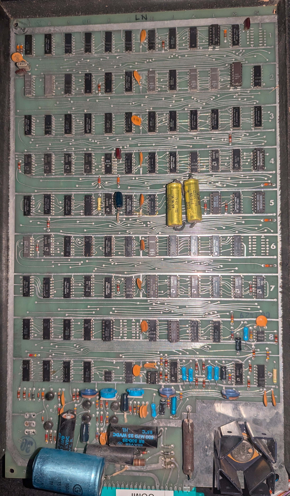

# Atari 'World Cup' (WCC/Goal IV) FPGA Recreation

This project is a VHDL recreation of the classic 1974 discrete logic arcade game known as 'World Cup' or 'Coupe du Monde' by Atari. The original PCB is marked 'WCC' and the game is also known as 'Goal IV'. Atari assigned the working ID 'TM-035' to this project.

## Project Goals and Methodology
- The VHDL code is designed to closely resemble the original schematics for maximum traceability and historical accuracy.
- All standard TTL logic is implemented as 74 series ICs (e.g., LS02, LS04, etc.) and saved in the `74LS` directory.
- Each 74 series IC is defined as a VHDL component, with ports and instance names matching the real IC pinout and PCB location.
- Pin connections in port maps are labeled to reflect both the pin number and the signal it connects to, aiding cross-referencing with the schematic.
- Individual VHD files will be created to represent each circuit as descibed by the manual.
- The file [Goal_IV_TM-035.pdf](Goal_IV_TM-035.pdf) is the original manual and schematics.
- [Goal_IV_TM-035_ocr.pdf](Goal_IV_TM-035_ocr.pdf) was craeted with OCR and adds metadata to the original PDF to make it searchable.
- [Goal_IV_TM-035.md](Goal_IV_TM-035.md) is a markdown file generated from the OCR process and further adjusted.

## Tooling
- This project is designed to be opened and configured with Quartus II version 13.0.1 Service Pack 1.

## Project Status
- The 74LS library is well-structured and includes many standard TTL logic chips as VHDL modules.
- The top-level design currently instantiates the clock divider and composite sync generator; further game logic is to be implemented.
- Testbenches are provided for many of the 74LS components and flip-flop primitives.

## Atari WCC PCB

