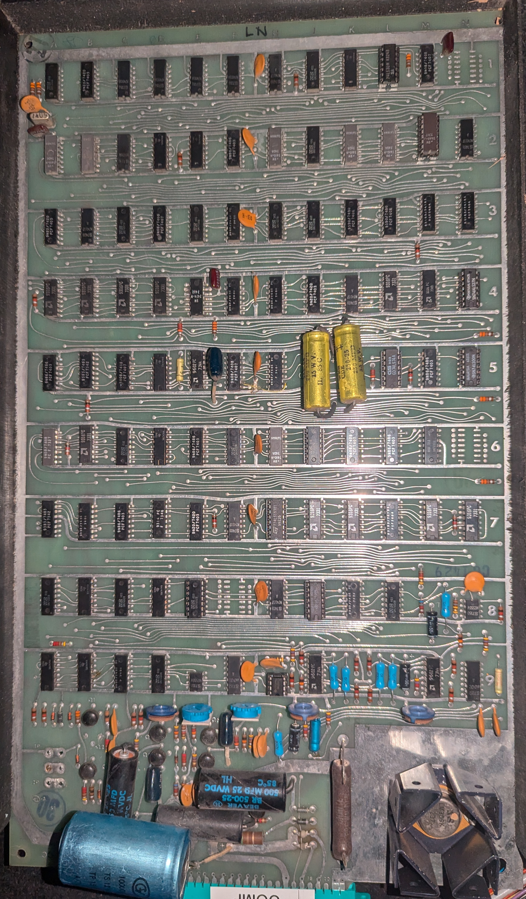

# Atari 'World Cup' (WCC/Goal IV) FPGA Recreation

This project is a VHDL recreation of the classic 1974 discrete logic arcade game known as 'World Cup', 'World Cup Football', 'Coupe du Monde' or 'Goal IV' by Atari. The original PCB is marked 'WCC' and was assigned the working ID 'TM-035'.

> **Status: Running in simulation and on FPGA hardware; video output tested successfully.**
> Quartus synthesis and fitting have passed for the Cyclone II EP2C5T144C8 board. The project owner confirmed on 24 September 2026 that the hardware video output looks good. GHDL simulation and the Python visualizer remain available for development. Full game integration is still in progress; this hardware check validates the displayed output, not every gameplay function.

## Current Implementation Status

| Phase | What | Status |
|-------|------|--------|
| Phase 0 | Foundation: clock, H/V sync, sync summing | **Done** |
| Phase 1 | Playfield circuit (Fig 9) | **Done** |
| Phase 2 | Game control: electronic latch, credit, start, game select, time line, serve timing | Exists — needs review/verification |
| Phase 3 | Ball system: motion, direction & speed, catch/kick, window/miss/bounce | **Done** |
| Phase 4 | Players: all forwards, defense/goalie (solid + striped), ramp, mux, summing | **Done** |
| Phase 5 | Score circuit, sound circuit, moving hole | Score circuit implemented and integrated; sound and moving hole remain unimplemented |
| Phase 6 | Video output and board integration | Board wrapper, PLL and composite output integrated; synthesis/fitting passed and hardware video tested. Original Fig 22 resistor network recreation remains outstanding |

See [AGENTS.md](AGENTS.md) for the full circuit-by-circuit breakdown.

## Project Goals and Methodology
- The VHDL code is designed to closely resemble the original schematics for maximum traceability and historical accuracy.
- All standard TTL logic is implemented as 74 series ICs (e.g., LS02, LS04, etc.) and saved in the `74LS` directory.
- Other ICs are saved in the `IC` directory.
- Each IC is defined as a VHDL entity, with ports and instance names matching the real IC pinout and PCB location.
- Pin connections in port maps are labeled to reflect both the pin number and the signal it connects to, aiding cross-referencing with the schematic.
- Individual VHD files will be created to represent each circuit as described by the manual.
- The file [Goal_IV_TM-035.pdf](Goal_IV_TM-035.pdf) is the original manual and schematics.
- [Goal_IV_TM-035_ocr.pdf](Goal_IV_TM-035_ocr.pdf) was created with OCR and adds metadata to the original PDF to make it searchable.
- [Goal_IV_TM-035.md](Goal_IV_TM-035.md) is a markdown file generated from the OCR process and further adjusted.

## Architecture

The design mirrors how the original 1970s hardware would work: discrete 74LS-series TTL ICs wired together at the gate/flip-flop level. Schematic-defined TTL logic must use **direct entity instantiation** (`entity work.LS04` etc.) for traceability and GHDL compatibility. The current implementation still includes behavioral models for analog functions and top-level serve/reset/miss control, plus direct video-combining logic; these are exceptions to the intended gate-level fidelity.

## Tooling
- Quartus II version 13.0.1 Service Pack 1 for synthesis.
- **GHDL** 0.37+ (mcode or LLVM backend) for simulation.
- **Python 3** with `Pillow` for image generation and optional `pygame` for interactive display.

## Running the Simulation

```bash
cd sim
bash run_sim.sh
```

This compiles the simulation sources, runs for **300 ms** by default, and calls the Python visualizer. Override the duration with, for example, `STOP_MS=900 bash run_sim.sh`. Output:

- `frame_data.txt` - Raw samples: `HSYNC VSYNC HBLANK VIDEO` captured at 7.142857 MHz (matching the current board clock)
- `frame_initial.png`, `frame_post_serve.png`, `frame_plus1.png` through `frame_plus5.png` - Keyframes at visualizer indices 1, 3, and 4–8
- `frame_output.png` - Copy of `frame_plus5.png` (index 8, 2x scale, green phosphor)
- `gameplay.gif` - Animated GIF of all complete frames (generated when >2 frames captured)
- `frame_output.ppm` - Written with `--ppm`, or as a fallback when `pygame` is unavailable

Requires Python 3 with `Pillow`: `pip3 install Pillow`

For VCD waveform debugging, add `--vcd=atari_wcc.vcd` to the GHDL run command in `run_sim.sh`.

## Board Build and Hardware Status

Use `atari_wcc_board` as the Quartus top-level for the Cyclone II EP2C5T144C8:

```bash
quartus_sh --flow compile atari_wcc
```

The board's 50 MHz oscillator feeds a PLL configured for **14.285714 MHz** (multiply 2, divide 7), giving a **7.142857 MHz** pixel clock. This is approximately 0.2268% slower than the original 14.318180 MHz master clock; the simulation testbench uses the same 70 ns period as the board configuration.

The wrapper uses the Sprint2/MaSTer composite-video connections and an external resistor network. Synthesis and fitting passed on 23 September 2026, using 764 of 4,608 logic elements. Hardware video was subsequently tested and reported to look good. Remaining timing-constraint warnings still require review; the visual test does not establish full timing closure.

See [board clock, pinout and build details](docs/MASTER_CLOCK_AND_VIDEO_ADOPTION.md).

## Documentation

- [AGENTS.md](AGENTS.md) - Agent instructions, circuit implementation plan, style guide, and full project status
- [docs/](docs/) - Build documentation, timing analysis, and implementation notes

## Atari WCC PCB

### IC Layout

Predominantly 74 series ICs.
The UA747 at F9 and N9 are opamps so are not implemented.

|       | A  | B  | C  | D  | E  | F  | H  | J  | K  | L  | M  | N  |
| -----:|:--:|:--:|:--:|:--:|:--:|:--:|:--:|:--:|:--:|:--:|:--:|:--:|
| **1** | [04](74LS/LS04.vhd) | [20](74LS/LS20.vhd) | [93](74LS/LS93.vhd) | [93](74LS/LS93.vhd) | [93](74LS/LS93.vhd) | [93](74LS/LS93.vhd) | [107](74LS/LS107.vhd) | [00](74LS/LS00.vhd) | [74](74LS/LS74.vhd) | [30](74LS/LS30.vhd) | [08](74LS/LS08.vhd) |  - |
| **2** | [10](74LS/LS10.vhd) | [107](74LS/LS107.vhd) | [30](74LS/LS30.vhd) | [74](74LS/LS74.vhd) | [74](74LS/LS74.vhd) | [86](74LS/LS86.vhd) | [10](74LS/LS10.vhd) | [04](74LS/LS04.vhd) | [10](74LS/LS10.vhd) | [10](74LS/LS10.vhd) | [48](74LS/LS48.vhd) | [107](74LS/LS107.vhd) |
| **3** | [20](74LS/LS20.vhd) | [107](74LS/LS107.vhd) | [00](74LS/LS00.vhd) | [08](74LS/LS08.vhd) | [04](74LS/LS04.vhd) | [02](74LS/LS02.vhd) | [27](74LS/LS27.vhd) | [00](74LS/LS00.vhd) | [90](74LS/LS90.vhd) | [90](74LS/LS90.vhd) | [153](74LS/LS153.vhd) | [153](74LS/LS153.vhd) |
| **4** |[9316](IC/IC9316.vhd)|[9316](IC/IC9316.vhd)|[9316](IC/IC9316.vhd)|[9316](IC/IC9316.vhd)| [74](74LS/LS74.vhd) | [02](74LS/LS02.vhd) | [02](74LS/LS02.vhd) | [20](74LS/LS20.vhd) | [107](74LS/LS107.vhd) |[9316](IC/IC9316.vhd)|[9316](IC/IC9316.vhd)| [27](74LS/LS27.vhd) |
| **5** | [86](74LS/LS86.vhd) | [83](74LS/LS83.vhd) | [08](74LS/LS08.vhd) | [74](74LS/LS74.vhd) |[9602](IC/IC9602.vhd)| [08](74LS/LS08.vhd) | [02](74LS/LS02.vhd) |[9602](IC/IC9602.vhd)|  - | [74](74LS/LS74.vhd) | [86](74LS/LS86.vhd) | [00](74LS/LS00.vhd) |
| **6** | [08](74LS/LS08.vhd) |[9316](IC/IC9316.vhd)| [04](74LS/LS04.vhd) | [74](74LS/LS74.vhd) | [86](74LS/LS86.vhd) | [00](74LS/LS00.vhd) | [10](74LS/LS10.vhd) | [27](74LS/LS27.vhd) | [08](74LS/LS08.vhd) | [86](74LS/LS86.vhd) | [92](74LS/LS92.vhd) |  - |
| **7** | [83](74LS/LS83.vhd) | [02](74LS/LS02.vhd) | [86](74LS/LS86.vhd) |[9314](IC/IC9314.vhd)| [20](74LS/LS20.vhd) | [107](74LS/LS107.vhd) | [153](74LS/LS153.vhd) |[9316](IC/IC9316.vhd)|[9316](IC/IC9316.vhd)| [153](74LS/LS153.vhd) |[9316](IC/IC9316.vhd)|[9316](IC/IC9316.vhd)|
| **8** | [04](74LS/LS04.vhd) | [74](74LS/LS74.vhd) | [00](74LS/LS00.vhd) | [74](74LS/LS74.vhd) | [00](74LS/LS00.vhd) |  - | [107](74LS/LS107.vhd) | [04](74LS/LS04.vhd) | [02](74LS/LS02.vhd) | [00](74LS/LS00.vhd) |  - | 555 |
| **9** | [74](74LS/LS74.vhd) | [74](74LS/LS74.vhd) | [02](74LS/LS02.vhd) | [04](74LS/LS04.vhd) | 555 | 747 | 555 |[9602](IC/IC9602.vhd)|  - |  - |[9602](IC/IC9602.vhd)| 747|

### PCB Image



### Playfield Layout (Reference Coordinates)
```
0, 140 to 144,     404 to 408, 548
 ______________________________   0
|    ______________________    |
|   |  __________________  |   |  80 to 84
|   | |                  | |   |
|   |_|                  |_|   |  128
|                              |
|                              |  162
|    _                    _    |
|   | |                  | |   |  196
|   | |__________________| |   |
|   |______________________|   |  240 to 244
|______________________________|
                                  324
```
