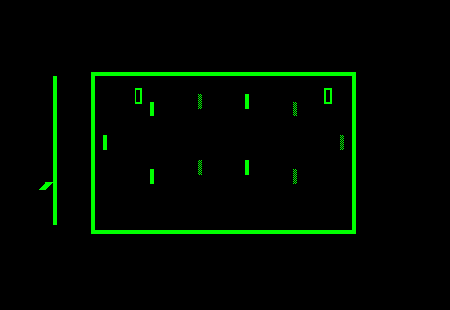
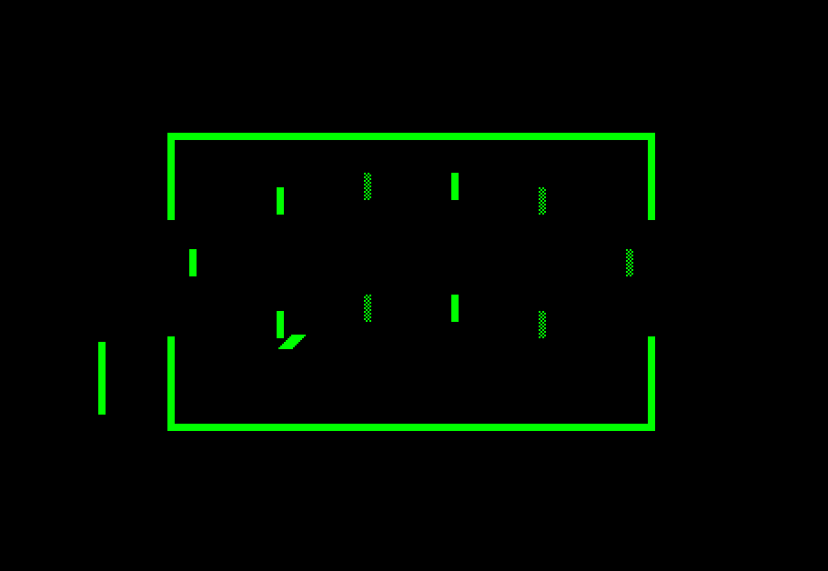
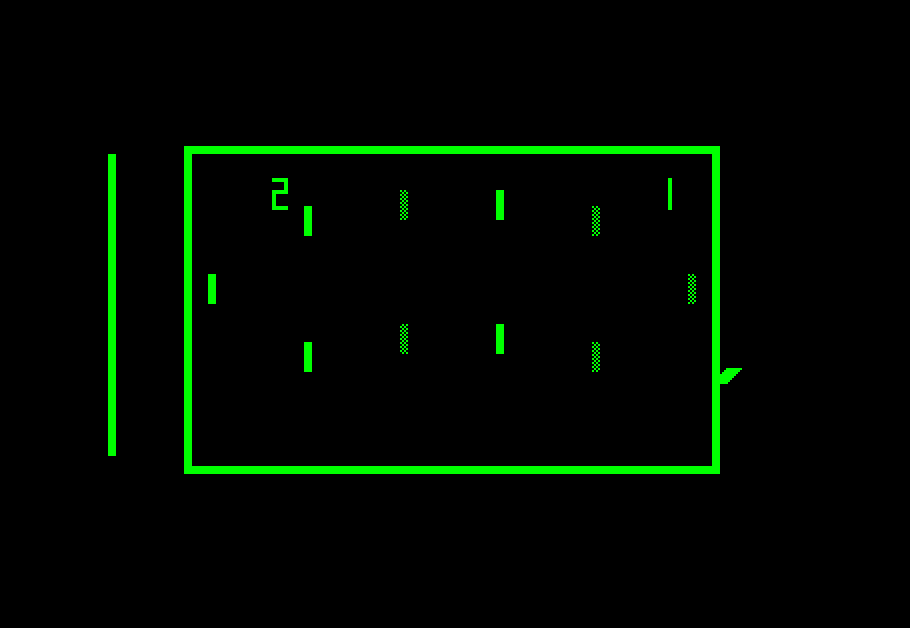

# JAMMA inputs and game control

The board boots into attract mode. A coin followed by Start begins a two-minute
(two-player) game; one game is enabled per coin. The time-line circuit ends the
game and returns to attract, with sound muted and scores retained.

## Electrical and schematic boundary

| Board input | FPGA pin | Released | Actuated |
| --- | --- | --- | --- |
| Coin1_I | 120 | High through weak pull-up | Normally-open contact to GND |
| Start1_I | 112 | High through weak pull-up | Normally-open contact to GND |

These are the Sprint2 connector assignments. Figure 8 instead shows grounded
common SPDT switches feeding contact-memory circuitry. `JammaSwitchAdapter`
explicitly models the settled contact-latch output: two synchronization stages,
then 35,714 stable CLOCK_7 samples (5 ms), then active-high PRESSED. It does not
pretend that complementary electrical signals reproduce SPDT contact debounce.
This FPGA/analogue boundary is behavioral; downstream game logic uses explicit
IC instances. Board reset retains its previous debug-button function.

## Figure 8 corrections and connections

- B8 is a ripple counter: FF1 clocks on 32V, FF2 clocks on FF1 Qn; both D inputs
  receive their own Qn. C8 pin 8 qualifies count three. Coin release clears B8.
- C9 pins 11/12/13 are a 7402 NOR gate, not a 7427. Start is enabled only after
  an accepted coin has been released.
- Both A9 clocks receive ATRC. A9 FF1 D is high; the plays-per-coin switch
  presets its Q for one play. The adapter converts the existing ONE_PLAYER
  configuration argument into that preset level. That argument means **plays
  per coin**, not the separate one-player versus two-player gameplay selector.
- The transistor electronic-latch model gives CR5 coin drive priority over
  expired credit, and initializes to the unlatched state. Static reset remains
  modeled but is tied inactive at the board integration.
- C9 gate 3 inhibits start requests during play. B9 produces START/STARTn and
  ATRC/ATRCn. ATRC is high in attract; ATRCn is high in play.
- The forced power-on START and 13 ms custom serve counter are removed.
  Sound, score blanking, window/miss logic, horizontal speed and timer now
  receive the actual attract signals.

## Serve and timer

Figure 12 J5 uses the tested pin-accurate IC9602 mode: START rising (GOALn high)
or GOALn falling (START low) triggers its serve one-shot. L5 still qualifies
release with V128n and the right-edge signal from H4. The same IC's catch
channel triggers on its A input falling and honors asynchronous clear.
The board uses 21,428,571 clocks (approximately three seconds) for both delays.
In idle attract, the one-shot is inactive and L5 naturally releases the ball.

The existing digital 555/RC timer approximation now advances over 857,142,840
CLOCK_7 cycles, nominally 120 seconds at the board's 7.142857 MHz clock. N4 ends
the game at the next qualifying lower-wall scan, so expiry is raster-quantized.
The D9 output stays high after the 555 delay until the next field; the old
V=240 cutoff incorrectly generated early END_OF_GAME pulses. Attract discharges
(resets) the modeled timer. Existing behavioral timer window coordinates are
retained; this is not a completed pin-for-pin recreation of K1/J2 and the RCs.

The player analogue models now interpret ATRCn correctly. In attract they
ignore POSITION and use fixed fallback positions (forwards 100, defense/goalie
0), preserving the existing board layout while keeping symbols visible.
These are model defaults, not measured analogue attract voltages. Potentiometer
and kick inputs remain unwired, and gameplay stays in two-player mode until
moving-hole and game-select integration are completed.

## Validation

Run `bash sim/run_control_tests.sh` for:

- Synchronization/debounce: idle, short bounce, press, hold, release bounce.
- Figure 8: power-on attract, unpaid Start rejection, short-coin rejection,
  count-three qualification, coin-release gating, one-field START, no restart
  during play, game expiry, and both one-/two-play credit settings.
- Figure 12: idle attract release, START/GOAL trigger polarity, delayed release,
  catch pulse and asynchronous clear.
- Timer: configured duration, no false END_OF_GAME beyond V240, attract rearm.

`bash sim/run_sound_tests.sh` also passes. `cd sim && bash run_sim.sh` runs a
650 ms capture with the **testbench**, rather than the core, driving coin and
Start. Its generics shorten the game to 300 ms and serve/catch to 50 ms. The
full-core assertions passed, including unpaid start, credit without automatic
start, paid start, ball release, mute at boot/expiry and exhausted-credit rejection.
Simulation failures now propagate from run_sim.sh instead of being suppressed.

Observed control trace:

| Event | Simulation time |
| --- | ---: |
| Credit enabled after coin release | 135.000 ms |
| Paid START / play mode | 175.812 ms |
| First serve release | 235.683 ms |
| Return to attract / credit exhausted | 493.802 ms |
| All sequence assertions complete | 600 ms |

The generated PNGs and GIF were inspected. Goals close in attract, open in play,
and close again at expiry; scores remain visible after expiry. The animation
still shows the pre-existing diagonal ball and occasional out-of-field positions;
these tests establish control sequencing, not complete ball/bounce fidelity.

Quartus 13.0sp1 compilation and fitting succeed with 1,027 / 4,608 logic elements;
the pin report confirms Coin1_I=120 and Start1_I=112, both with weak pull-ups.
Timing requirements are not met, including incomplete clock/I/O constraints and
hold violations. Quartus also emulates dual asynchronous preset/clear registers
with latch circuitry. Hardware input testing, power-up behavior and listening
remain to be checked on the board; compilation is not timing closure.
